# MODUL TUTORIAL WEB 4
## MSIM4310 Analisis dan Visualisasi Data
### Program Studi Sistem Informasi — Universitas Terbuka

---

> **Alokasi Waktu Tutorial (60 menit)**
>
> | Sesi | Topik | AB | Durasi |
> |---|---|---|---|
> | 1 | Konsep & Visualisasi Data Teks | AB11 & AB12 | 15 menit |
> | 2 | Konsep & Visualisasi Data Interaktif | AB13 & AB14 | 25 menit |
> | 3 | Dashboard Interaktif | AB15 | 10 menit |
> | 4 | Buffer & Tanya Jawab | — | 10 menit |
>
> **Catatan:** Modul ini adalah **sesi terakhir** tutorial web. Setelah ini, mahasiswa
> diharapkan mampu menggabungkan seluruh alur — dari data mentah hingga dashboard
> interaktif yang bisa dieksplor mandiri.

---

## Daftar Isi

1. [Sesi 1 — Konsep & Visualisasi Data Teks (AB11 & AB12)](#sesi1)
2. [Sesi 2 — Konsep & Visualisasi Data Interaktif (AB13 & AB14)](#sesi2)
3. [Sesi 3 — Dashboard Interaktif (AB15)](#sesi3)
4. [Latihan Terpadu: Dari Teks ke Dashboard](#latihan)
5. [Referensi](#referensi)

---

## Sesi 1 — Konsep & Visualisasi Data Teks (AB11 & AB12) {#sesi1}
### ⏱ 15 menit

### Ringkasan Konsep

Data teks adalah data yang dinyatakan dalam bentuk kata, kalimat, atau paragraf —
berbeda dengan data numerik. Sumber umumnya: ulasan produk, komentar media sosial,
transkrip wawancara, laporan, dokumen PDF.

**Pipeline teks: dari mentah ke visual**

```
Teks Mentah
    ↓ Lowercase + hapus tanda baca
Teks Bersih
    ↓ Tokenisasi (pecah jadi kata)
Token
    ↓ Hapus stop words
Token Bermakna
    ↓ Hitung frekuensi / analisis sentimen
Tabel Frekuensi
    ↓ Visualisasi
Word Cloud / Bar Plot / Bigram Network / Heatmap
```

**Lima teknik visualisasi teks yang perlu dikuasai:**

| Teknik | Fungsi | Paket R |
|---|---|---|
| Word Cloud | Gambaran umum kata dominan | `wordcloud` |
| Bar Plot Frekuensi | Perbandingan frekuensi yang presisi | `ggplot2` |
| Bigram Network | Relasi dua kata yang berdekatan | `igraph` / `ggraph` |
| Sentiment Visualization | Pola emosi/opini dalam teks | `tidytext` + `ggplot2` |
| Heatmap Kata | Distribusi kata per dokumen | `ggplot2` |

> **Mengapa bar plot lebih diutamakan dari word cloud untuk analisis?**
> Word cloud menarik secara visual tapi sulit dibandingkan secara akurat — mata manusia
> buruk dalam membandingkan ukuran font. Bar plot memberikan perbandingan yang tepat.
> Gunakan word cloud untuk presentasi/komunikasi umum, bar plot untuk analisis.

---

### Kode R: Pipeline Teks Lengkap

> ⚠️ **Catatan kode AB12:** Kode di modul AB12 mengalami encoding error pada bagian
> pembuatan `tibble` (karakter `<` dan `>` rusak karena konversi HTML). Kode di bawah
> adalah versi yang diperbaiki dan dapat langsung dijalankan.

#### Langkah 0 — Instalasi Paket

```r
install.packages(c("dplyr","stringr","tidytext","ggplot2",
                   "wordcloud","RColorBrewer","igraph","ggraph"))
```

> **Penjelasan:** Paket-paket ini perlu diinstal sekali saja. Setelah itu, setiap sesi R
> baru cukup memanggil `library()`. Jika sudah terinstal, langkah ini bisa dilewati.

---

#### Langkah 1 — Muat Paket & Buat Dataset

```r
library(dplyr)
library(stringr)
library(tidytext)
library(ggplot2)
library(wordcloud)
library(RColorBrewer)

# ---- Dataset: ulasan layanan online (simulasi) ----
df_text <- tibble::tibble(
  id   = 1:10,
  teks = c(
    "Pelayanan cepat dan sangat ramah, saya puas dengan layanan ini",
    "Aplikasi bagus tapi kadang lambat dan sering error saat login",
    "Harga terjangkau kualitas oke, pengiriman tepat waktu",
    "Pengiriman terlambat namun respon customer service cepat dan baik",
    "Sangat recommended, mudah digunakan dan fitur lengkap sekali",
    "Kualitas produk kurang memuaskan, tidak sesuai dengan deskripsi",
    "Layanan prima, harga kompetitif dan pengiriman sangat cepat",
    "Aplikasi sering crash, perlu banyak perbaikan di versi berikutnya",
    "Produk bagus dan sesuai ekspektasi, packaging rapi dan aman",
    "Customer service tidak responsif, kecewa dengan pengalaman belanja"
  )
)
```

**Penjelasan baris per baris:**

| Kode | Penjelasan |
|---|---|
| `library(dplyr)` | Memuat paket manipulasi data (pipe `%>%`, `mutate`, `filter`, dll.) |
| `library(stringr)` | Memuat paket manipulasi teks (`str_to_lower`, `str_replace_all`, dll.) |
| `library(tidytext)` | Memuat paket text mining gaya tidy (`unnest_tokens`, `anti_join`) |
| `library(ggplot2)` | Memuat paket visualisasi grafik |
| `library(wordcloud)` | Memuat paket pembuat word cloud |
| `library(RColorBrewer)` | Memuat paket palet warna siap pakai |
| `tibble::tibble()` | Membuat data frame modern (tibble) — lebih aman dari `data.frame()` karena tidak mengubah nama kolom secara diam-diam |
| `id = 1:10` | Kolom ID nomor 1 sampai 10 |
| `teks = c(...)` | Kolom berisi 10 kalimat ulasan pelanggan |

---

#### Langkah 2 — Preprocessing Teks

```r
df_clean <- df_text %>%
  mutate(
    teks = str_to_lower(teks),
    teks = str_replace_all(teks, "[^a-z\\s]", " "),
    teks = str_squish(teks)
  )
```

**Penjelasan langkah preprocessing:**

| Fungsi | Apa yang dilakukan | Contoh |
|---|---|---|
| `str_to_lower()` | Ubah semua huruf jadi huruf kecil | `"Cepat"` → `"cepat"` |
| `str_replace_all(teks, "[^a-z\\s]", " ")` | Hapus semua karakter selain huruf a-z dan spasi (termasuk koma, titik, angka) | `"ramah,"` → `"ramah "` |
| `str_squish()` | Hapus spasi ganda atau spasi di awal/akhir | `"  cepat  "` → `"cepat"` |

> **Mengapa preprocessing penting?** Tanpa langkah ini, kata `"Cepat"` dan `"cepat"` akan
> dihitung sebagai dua kata berbeda, dan karakter seperti koma ikut masuk ke token.

---

#### Langkah 3 — Stop Words Bahasa Indonesia

```r
stopwords_id <- c("dan", "yang", "di", "ke", "dari", "ini", "itu",
                  "dengan", "untuk", "atau", "adalah", "tidak", "saya",
                  "kami", "kita", "ada", "akan", "sudah", "bisa",
                  "tapi", "namun", "juga", "sangat", "lebih", "sering",
                  "saat", "perlu", "sesuai", "dalam")

stop_df <- tibble::tibble(word = stopwords_id)
```

**Penjelasan:**

Stop words adalah kata-kata yang sangat sering muncul tetapi tidak mengandung makna
substantif dalam konteks analisis (kata fungsi, kata penghubung). Paket `tidytext`
menyediakan daftar stop words bahasa Inggris (`stop_words`), tetapi **tidak mencakup
Bahasa Indonesia** — sehingga kita perlu membuat daftar manual.

> **Tips:** Daftar stop words ini bisa diperluas sesuai kebutuhan analisis. Misalnya,
> jika dataset berisi banyak kata "produk" yang tidak informatif, bisa ditambahkan.

---

#### Langkah 4 — Tokenisasi & Frekuensi

```r
freq <- df_clean %>%
  tidytext::unnest_tokens(word, teks) %>%
  anti_join(stop_df, by = "word") %>%
  count(word, sort = TRUE)

cat("=== 10 Kata Teratas ===\n")
print(head(freq, 10))
```

**Penjelasan pipeline:**

```
df_clean
  └─► unnest_tokens(word, teks)   # Pecah setiap kalimat jadi baris-baris kata
  └─► anti_join(stop_df)          # Buang baris yang kata-nya ada di stop words
  └─► count(word, sort=TRUE)      # Hitung frekuensi setiap kata, urutkan terbanyak
```

| Fungsi | Penjelasan |
|---|---|
| `unnest_tokens(word, teks)` | Memecah kolom `teks` menjadi baris individual per kata, hasilnya disimpan di kolom `word` |
| `anti_join(stop_df, by = "word")` | Membuang semua baris di mana `word` ada di `stop_df` — kebalikan dari `inner_join` |
| `count(word, sort = TRUE)` | Menghitung berapa kali setiap kata muncul, diurutkan dari terbanyak |

**Output yang dihasilkan:**

```
=== 10 Kata Teratas ===
# A tibble: 10 × 2
   word           n
   <chr>      <int>
 1 cepat          3
 2 pengiriman     3
 3 aplikasi       2
 4 bagus          2
 5 customer       2
 6 harga          2
 7 kualitas       2
 8 layanan        2
 9 produk         2
10 service        2
```

**Interpretasi:** Kata `cepat` dan `pengiriman` muncul 3 kali — paling dominan. Ini
mengindikasikan aspek kecepatan pengiriman adalah topik utama dalam ulasan pelanggan,
baik sebagai pujian maupun kritik.

---

#### Visualisasi 1 — Bar Plot Frekuensi

```r
top10 <- freq %>% slice_max(n, n = 10)

ggplot(top10, aes(x = reorder(word, n), y = n)) +
  geom_col(fill = "#4E79A7") +
  geom_text(aes(label = n), hjust = -0.3, size = 3.5) +
  coord_flip() +
  labs(
    title    = "10 Kata Paling Sering Muncul dalam Ulasan",
    subtitle = "Setelah penghapusan stop words Bahasa Indonesia",
    x = "Kata", y = "Frekuensi"
  ) +
  scale_y_continuous(expand = expansion(mult = c(0, 0.15))) +
  theme_minimal()
```

**Penjelasan parameter kunci:**

| Kode | Penjelasan |
|---|---|
| `slice_max(n, n = 10)` | Ambil 10 baris dengan nilai `n` tertinggi |
| `reorder(word, n)` | Urutkan kata berdasarkan frekuensi agar bar tersusun rapi |
| `geom_col()` | Bar chart dari nilai langsung (bukan hitung otomatis seperti `geom_bar`) |
| `geom_text(aes(label = n), hjust = -0.3)` | Tambah label angka di ujung bar, sedikit ke kanan (`hjust < 0`) |
| `coord_flip()` | Balik sumbu X dan Y — kata di sumbu Y lebih mudah dibaca horizontal |
| `scale_y_continuous(expand = expansion(mult = c(0, 0.15)))` | Beri ruang 15% di kanan agar label angka tidak terpotong |

**Hasil visualisasi:**

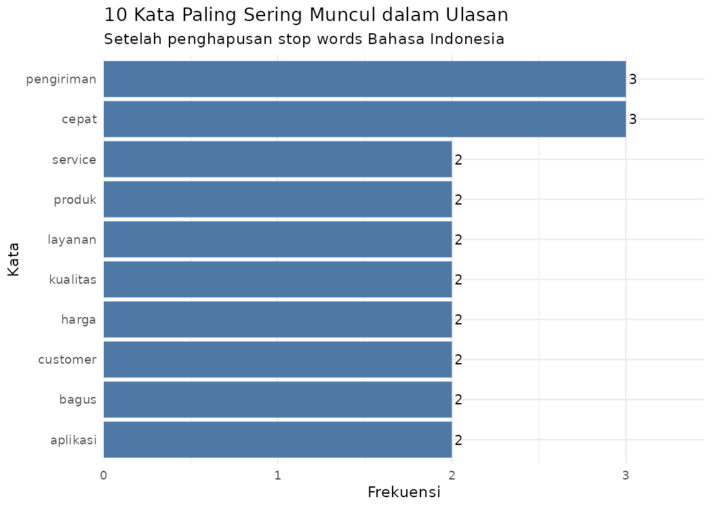

> **Cara membaca:** Semakin panjang bar, semakin sering kata tersebut muncul. Berbeda
> dengan word cloud, perbedaan panjang bar dapat diukur secara akurat.

---

#### Visualisasi 2 — Word Cloud

```r
set.seed(123)
wordcloud(
  words        = freq$word,
  freq         = freq$n,
  min.freq     = 1,
  max.words    = 50,
  random.order = FALSE,
  colors       = brewer.pal(8, "Dark2"),
  scale        = c(3, 0.5)
)
```

**Penjelasan parameter:**

| Parameter | Penjelasan |
|---|---|
| `set.seed(123)` | Atur angka acak agar posisi kata reproducible (hasilnya sama setiap dijalankan) |
| `words = freq$word` | Vektor kata-kata |
| `freq = freq$n` | Frekuensi masing-masing kata (menentukan ukuran font) |
| `min.freq = 1` | Tampilkan kata yang muncul minimal 1 kali |
| `max.words = 50` | Maksimal 50 kata ditampilkan |
| `random.order = FALSE` | Kata paling sering di tengah (bukan acak) |
| `colors = brewer.pal(8, "Dark2")` | Gunakan 8 warna dari palet `Dark2` |
| `scale = c(3, 0.5)` | Rasio ukuran font: kata paling besar 3x, paling kecil 0.5x |

**Hasil visualisasi:**

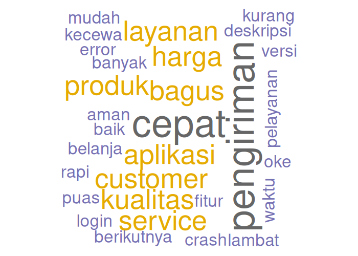

> **Catatan:** Word cloud menggunakan `set.seed(123)` agar posisi kata konsisten setiap
> kali dijalankan. Tanpa `set.seed`, posisi kata akan berbeda setiap run.

---

#### Visualisasi 3 — Bigram Network

```r
library(igraph)
library(ggraph)

bigrams <- df_clean %>%
  tidytext::unnest_tokens(bigram, teks, token = "ngrams", n = 2) %>%
  filter(!is.na(bigram)) %>%
  tidyr::separate(bigram, c("word1", "word2"), sep = " ") %>%
  filter(!word1 %in% stopwords_id,
         !word2 %in% stopwords_id) %>%
  count(word1, word2, sort = TRUE) %>%
  filter(n >= 1)

cat("=== Bigram Teratas ===\n")
print(head(bigrams, 10))

bigram_graph <- graph_from_data_frame(bigrams)

set.seed(42)
ggraph(bigram_graph, layout = "fr") +
  geom_edge_link(aes(edge_alpha = n), show.legend = FALSE,
                 arrow = arrow(length = unit(3, "mm")),
                 end_cap = circle(3, "mm")) +
  geom_node_point(color = "#4E79A7", size = 4) +
  geom_node_text(aes(label = name), repel = TRUE, size = 3.5) +
  labs(title = "Bigram Network: Relasi Kata dalam Ulasan") +
  theme_graph()
```

**Konsep bigram:**

> Bigram adalah pasangan dua kata yang berdekatan dalam kalimat. Misalnya, kalimat
> `"customer service cepat"` menghasilkan bigram: `customer→service` dan `service→cepat`.
> Bigram memberikan konteks yang tidak bisa ditangkap oleh analisis kata tunggal.

**Penjelasan kode:**

| Kode | Penjelasan |
|---|---|
| `token = "ngrams", n = 2` | Tokenisasi menjadi bigram (pasangan 2 kata), bukan kata tunggal |
| `tidyr::separate(bigram, c("word1","word2"), sep=" ")` | Pisah kolom bigram menjadi dua kolom `word1` dan `word2` |
| `filter(!word1 %in% stopwords_id, ...)` | Buang bigram yang salah satu katanya adalah stop word |
| `graph_from_data_frame(bigrams)` | Ubah tabel bigram menjadi objek graf (node = kata, edge = hubungan) |
| `ggraph(..., layout = "fr")` | Visualisasikan graf dengan algoritma Fruchterman-Reingold (posisi node berdasarkan kekuatan koneksi) |
| `geom_edge_link(aes(edge_alpha = n))` | Tebal/transparansi garis proporsional frekuensi bigram |
| `arrow = arrow(...)` | Tambahkan panah untuk menunjukkan urutan kata |

**Output tabel bigram:**

```
=== Bigram Teratas ===
# A tibble: 10 × 3
   word1      word2          n
   <chr>      <chr>      <int>
 1 customer   service        2
 2 aplikasi   bagus          1
 3 banyak     perbaikan      1
 4 ekspektasi packaging      1
 5 fitur      lengkap        1
 6 harga      kompetitif     1
 7 harga      terjangkau     1
 8 kadang     lambat         1
 9 kualitas   oke            1
10 kualitas   produk         1
```

**Hasil visualisasi:**

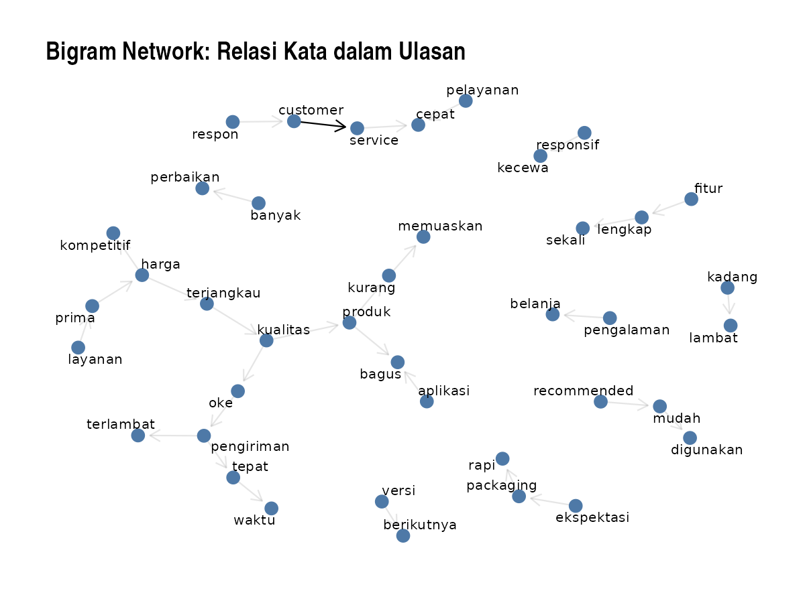

**Interpretasi:** Pasangan `customer → service` muncul 2 kali (garis lebih tebal),
mengkonfirmasi bahwa "customer service" adalah entitas yang sering dibahas bersama —
tidak terpisah. Ini informasi yang hilang jika hanya melihat frekuensi kata tunggal.

---

#### Visualisasi 4 — Analisis Sentimen

```r
sentimen_id <- tibble::tibble(
  word      = c("puas", "bagus", "cepat", "ramah", "recommended",
                "oke", "prima", "kompetitif", "rapi", "baik",
                "lambat", "error", "terlambat", "kecewa", "kurang",
                "crash", "tidak"),
  sentiment = c("positif","positif","positif","positif","positif",
                "positif","positif","positif","positif","positif",
                "negatif","negatif","negatif","negatif","negatif",
                "negatif","negatif")
)

sent_result <- df_clean %>%
  tidytext::unnest_tokens(word, teks) %>%
  inner_join(sentimen_id, by = "word") %>%
  count(word, sentiment, sort = TRUE)

ggplot(sent_result, aes(x = reorder(word, n), y = n, fill = sentiment)) +
  geom_col(show.legend = TRUE) +
  coord_flip() +
  scale_fill_manual(values = c("positif" = "#59A14F", "negatif" = "#E15759")) +
  facet_wrap(~sentiment, scales = "free_y") +
  labs(
    title = "Kata Bersentimen dalam Ulasan Layanan",
    x = NULL, y = "Frekuensi"
  ) +
  theme_minimal()
```

**Pendekatan lexicon-based:**

Analisis sentimen berbasis leksikon bekerja dengan mencocokkan setiap token dengan kamus
sentimen. Jika kata ada di kamus → beri label sentimennya. Karena paket `tidytext` hanya
menyediakan kamus bahasa Inggris (bing, afinn, nrc), kita perlu **membuat kamus mini
Bahasa Indonesia** secara manual.

**Penjelasan kode:**

| Kode | Penjelasan |
|---|---|
| `inner_join(sentimen_id, by = "word")` | Hanya pertahankan token yang ada di kamus sentimen (berbeda dari `anti_join` yang membuang) |
| `facet_wrap(~sentiment, scales = "free_y")` | Bagi plot menjadi dua panel (positif dan negatif), dengan skala Y bebas per panel |
| `scale_fill_manual(...)` | Atur warna manual: hijau untuk positif, merah untuk negatif |

**Output tabel sentimen:**

```
# A tibble: 17 × 3
   word        sentiment     n
   <chr>       <chr>     <int>
 1 cepat       positif       3
 2 bagus       positif       2
 3 tidak       negatif       2
 4 baik        positif       1
 5 crash       negatif       1
 6 error       negatif       1
 7 kecewa      negatif       1
 8 kompetitif  positif       1
 9 kurang      negatif       1
10 lambat      negatif       1
   ...
```

**Hasil visualisasi:**

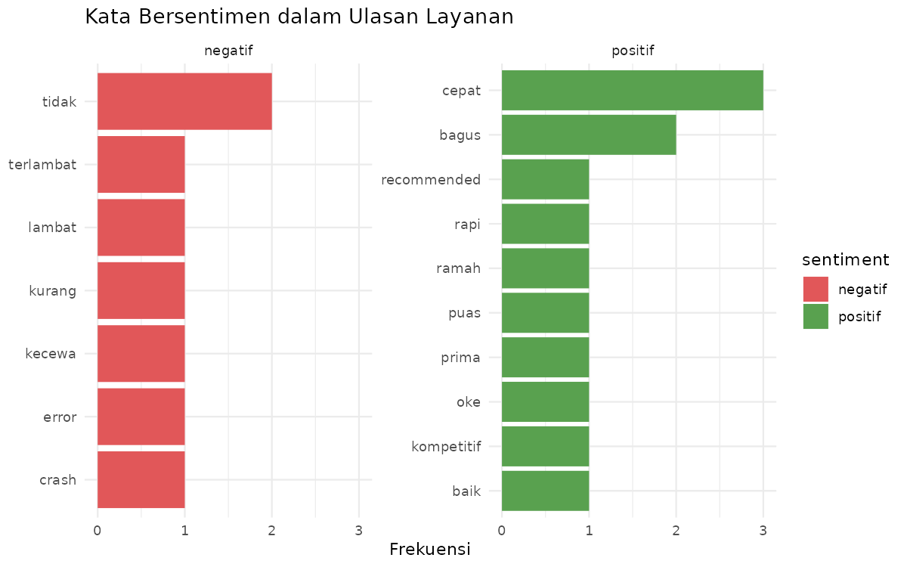

**Interpretasi:** Dataset ulasan ini **lebih banyak bersentimen positif** — kata positif
seperti `cepat` (3x), `bagus` (2x), `baik` (1x) mendominasi. Kata negatif terdistribusi
lebih merata. Simpulan: secara keseluruhan pelanggan puas, namun ada isu spesifik (crash,
error, keterlambatan) yang perlu ditangani.

---

### ✅ Cek Pemahaman — Data Teks

1. Apa yang terjadi jika step *hapus stop words* dilewati? Coba jalankan tanpa `anti_join()` dan bandingkan hasilnya.
2. Dari bar plot, kata apa yang paling dominan? Apa yang bisa Anda simpulkan tentang topik ulasan ini?
3. Mengapa bigram network lebih informatif dibanding daftar kata tunggal untuk memahami konteks?
4. Dari sentiment analysis, apakah ulasan dalam dataset ini cenderung positif atau negatif? Berdasarkan apa kesimpulan Anda?
5. **Tantangan:** Kamus sentimen manual di atas sangat terbatas. Tambahkan 5 kata positif dan 5 kata negatif yang relevan, lalu jalankan ulang. Apakah hasilnya berubah?

---

## Sesi 2 — Konsep & Visualisasi Data Interaktif (AB13 & AB14) {#sesi2}
### ⏱ 25 menit

### Ringkasan Konsep

**Statis vs Interaktif** — bukan soal mana yang lebih baik, tapi mana yang tepat untuk tujuan:

| | Statis | Interaktif |
|---|---|---|
| **Tujuan** | Komunikasi final, laporan | Eksplorasi, pengambilan keputusan |
| **Audiens** | Pembaca pasif | Pengguna aktif |
| **Cocok untuk** | Publikasi, cetak, email | Dashboard, presentasi live |
| **Risiko** | Informasi terbatas | Terlalu banyak fitur → membingungkan |

> **Rule of thumb:** Jika audiensnya perlu *memahami satu pesan* → statis.
> Jika audiensnya perlu *menjawab pertanyaannya sendiri* → interaktif.

**Fitur interaksi yang umum digunakan:**

| Fitur | Fungsi | Implementasi di R |
|---|---|---|
| Hover/Tooltip | Info tambahan saat kursor di atas titik | `plotly` |
| Filter/Slicer | Pilih subset data | `Shiny::selectInput()` |
| Zoom & Pan | Perbesar area tertentu | `plotly` (built-in) |
| Drill-down | Lihat detail dari summary | `plotly` + `Shiny` |
| Tabel interaktif | Search, sort, pagination | `DT` |
| Peta interaktif | Klik marker, layer control | `leaflet` |

**Toolkit R untuk visualisasi interaktif (dari mudah ke kompleks):**

```
plotly    → grafik interaktif (scatter, line, bar, histogram)
DT        → tabel interaktif
leaflet   → peta interaktif
flexdash  → layout dashboard (tanpa reaktivitas penuh)
Shiny     → aplikasi web reaktif penuh (UI + Server)
```

---

### Kode R: Dari Statis ke Interaktif

#### Bagian A — plotly: Mengubah ggplot menjadi Interaktif

```r
# install.packages(c("ggplot2", "plotly", "dplyr"))
library(ggplot2)
library(plotly)
library(dplyr)

data(mtcars)
mtcars$model <- rownames(mtcars)
mtcars$cyl   <- as.factor(mtcars$cyl)
```

**Penjelasan setup:**

| Kode | Penjelasan |
|---|---|
| `data(mtcars)` | Muat dataset bawaan R berisi spesifikasi 32 mobil tahun 1973-74 |
| `mtcars$model <- rownames(mtcars)` | Nama baris (nama model mobil) disimpan sebagai kolom baru |
| `as.factor(mtcars$cyl)` | Ubah jumlah silinder (4, 6, 8) dari numerik ke faktor agar diperlakukan sebagai kategori dalam pewarnaan |

```r
# ---- Langkah 1: Buat ggplot biasa ----
p_static <- ggplot(mtcars,
                   aes(x = wt, y = mpg,
                       color = cyl,
                       text  = paste0("Model: ", model,
                                      "<br>Berat: ", wt, " (1000 lbs)",
                                      "<br>MPG: ", mpg,
                                      "<br>Silinder: ", cyl))) +
  geom_point(size = 3, alpha = 0.8) +
  scale_color_manual(values = c("4" = "#59A14F",
                                "6" = "#F28E2B",
                                "8" = "#E15759")) +
  labs(
    title  = "Hubungan Berat vs Efisiensi Bahan Bakar",
    x      = "Berat Kendaraan (1000 lbs)",
    y      = "Efisiensi (mpg)",
    color  = "Silinder"
  ) +
  theme_minimal()

# ---- Langkah 2: Tambahkan interaktivitas dengan satu baris ----
ggplotly(p_static, tooltip = "text")
```

**Penjelasan kunci:**

| Kode | Penjelasan |
|---|---|
| `aes(..., text = paste0(...))` | Estetika `text` tidak digunakan oleh `ggplot2`, tapi dipakai oleh `ggplotly()` sebagai konten tooltip |
| `"<br>"` | Tag HTML untuk baris baru dalam tooltip — tooltip plotly mendukung HTML sederhana |
| `ggplotly(p_static, tooltip = "text")` | Satu baris ini mengubah grafik ggplot statis menjadi interaktif — zoom, pan, tooltip, dan download tersedia otomatis |

**Hasil visualisasi (versi statis):**

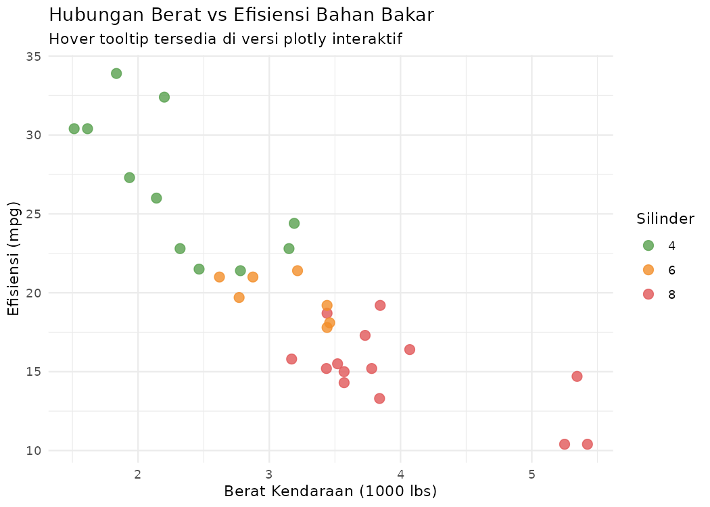

> **Di RStudio:** Ketika dijalankan, grafik akan muncul di panel Viewer dengan kemampuan
> hover (arahkan kursor ke titik untuk melihat detail model, berat, MPG, silinder),
> zoom in/out, dan unduh sebagai PNG.

**Pola yang terlihat:** Kendaraan bersilinder 8 (merah) cenderung lebih berat dan boros
bahan bakar. Kendaraan silinder 4 (hijau) lebih ringan dan efisien. Ada korelasi negatif
kuat antara berat dan MPG.

---

```r
# ---- plotly native: Bar chart interaktif ----
df_cyl <- mtcars %>%
  count(cyl) %>%
  rename(jumlah = n)

plot_ly(df_cyl,
        x = ~cyl,
        y = ~jumlah,
        type = "bar",
        color = ~cyl,
        colors = c("4" = "#59A14F", "6" = "#F28E2B", "8" = "#E15759"),
        hovertemplate = "Silinder: %{x}<br>Jumlah: %{y}<extra></extra>") %>%
  layout(
    title  = "Jumlah Kendaraan per Jumlah Silinder",
    xaxis  = list(title = "Jumlah Silinder"),
    yaxis  = list(title = "Jumlah Kendaraan"),
    showlegend = FALSE
  )
```

**Sintaks `plot_ly()` vs `ggplotly()`:**

| | `ggplotly()` | `plot_ly()` |
|---|---|---|
| **Cara kerja** | Konversi dari ggplot | Native plotly langsung |
| **Kemudahan** | Lebih mudah (familiar dengan ggplot2) | Lebih fleksibel, tapi sintaks berbeda |
| **Gunakan jika** | Sudah ada kode ggplot | Perlu kontrol penuh atas interaktivitas |

**Penjelasan parameter `plot_ly`:**

| Parameter | Penjelasan |
|---|---|
| `x = ~cyl` | Tanda `~` (tilde) berarti "ambil dari data frame" — sama dengan `aes()` di ggplot2 |
| `type = "bar"` | Jenis grafik: bar chart |
| `hovertemplate` | Format tooltip saat hover; `%{x}` dan `%{y}` adalah placeholder untuk nilai sumbu; `<extra></extra>` menghilangkan info trace tambahan |

**Hasil visualisasi:**

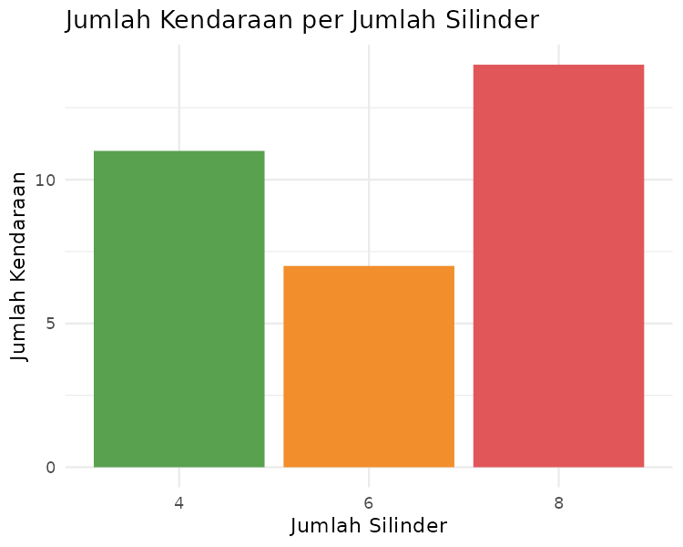

---

#### Bagian B — DT: Tabel Interaktif

```r
library(DT)

mtcars_tabel <- mtcars %>%
  select(model, mpg, wt, hp, cyl) %>%
  rename(
    Model    = model,
    `MPG`    = mpg,
    `Berat`  = wt,
    `Tenaga` = hp,
    `Silinder` = cyl
  )

datatable(
  mtcars_tabel,
  options = list(
    pageLength = 8,
    autoWidth  = TRUE,
    dom        = "Bfrtip",
    buttons    = c("csv", "excel")
  ),
  extensions = "Buttons",
  caption    = "Tabel Interaktif: Dataset mtcars | Klik kolom untuk sort",
  filter     = "top",
  rownames   = FALSE
) %>%
  formatRound(columns = c("MPG", "Berat", "Tenaga"), digits = 1) %>%
  formatStyle(
    "MPG",
    background = styleColorBar(mtcars_tabel$MPG, "#4E79A7"),
    backgroundSize = "100% 90%",
    backgroundRepeat = "no-repeat",
    backgroundPosition = "center"
  )
```

**Penjelasan parameter `datatable()`:**

| Parameter | Penjelasan |
|---|---|
| `pageLength = 8` | Tampilkan 8 baris per halaman |
| `autoWidth = TRUE` | Lebar kolom menyesuaikan konten otomatis |
| `dom = "Bfrtip"` | Komponen yang ditampilkan: **B**utton, **f**ilter, **r**ecords, **t**able, **i**nfo, **p**agination |
| `buttons = c("csv","excel")` | Tombol download data dalam format CSV dan Excel |
| `extensions = "Buttons"` | Aktifkan ekstensi tombol download (perlu disebutkan secara eksplisit) |
| `filter = "top"` | Tampilkan kotak filter di atas setiap kolom |
| `rownames = FALSE` | Sembunyikan nomor baris default R |
| `formatRound(digits = 1)` | Bulatkan angka desimal menjadi 1 angka di belakang koma |
| `formatStyle("MPG", background = styleColorBar(...))` | Tambahkan mini bar chart berwarna di dalam sel kolom MPG |

> **Fitur interaktif DT:** Klik header kolom untuk sort naik/turun. Gunakan kotak
> filter per kolom untuk menyaring data. Klik tombol CSV/Excel untuk mengunduh data.

---

#### Bagian C — leaflet: Peta Interaktif

```r
library(leaflet)

kantor_ut <- data.frame(
  nama = c("UT Pusat (Tangerang Selatan)", "UPBJJ Jakarta",
           "UPBJJ Bandung", "UPBJJ Surabaya", "UPBJJ Medan"),
  lat  = c(-6.3615, -6.2088, -6.9175, -7.2575, 3.5952),
  lng  = c(106.7527, 106.8456, 107.6191, 112.7521, 98.6722),
  mhs  = c(0, 45230, 38120, 52100, 29800)
)

leaflet(kantor_ut) %>%
  addTiles() %>%
  addCircleMarkers(
    lng    = ~lng,
    lat    = ~lat,
    radius = ~sqrt(mhs/500),
    color  = "#4E79A7",
    fillOpacity = 0.7,
    popup  = ~paste0("<b>", nama, "</b><br>",
                     "Mahasiswa: ",
                     ifelse(mhs > 0, format(mhs, big.mark="."), "Data Pusat"))
  ) %>%
  addLegend("bottomright",
            colors = "#4E79A7",
            labels = "Lokasi UPBJJ UT",
            title  = "Jaringan UT")
```

**Penjelasan kode leaflet:**

| Kode | Penjelasan |
|---|---|
| `lat` / `lng` | Koordinat lintang (latitude) dan bujur (longitude) dalam derajat desimal |
| `leaflet(kantor_ut)` | Inisialisasi peta dengan data `kantor_ut` |
| `addTiles()` | Tambahkan layer peta latar (OpenStreetMap default) |
| `addCircleMarkers(...)` | Tambahkan marker berbentuk lingkaran |
| `radius = ~sqrt(mhs/500)` | Jari-jari proporsional akar kuadrat jumlah mahasiswa — akar kuadrat digunakan agar luas lingkaran proporsional, bukan radius |
| `popup = ~paste0(...)` | Konten pop-up HTML yang muncul saat marker diklik |
| `format(mhs, big.mark=".")` | Format angka dengan pemisah ribuan titik: `45230` → `45.230` |
| `addLegend(...)` | Tambahkan legenda di pojok kanan bawah |

**Pratinjau lokasi UPBJJ (versi statis):**

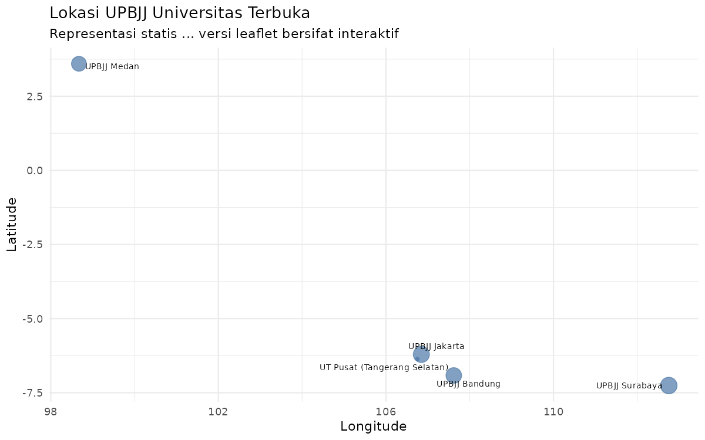

> **Di RStudio:** Peta `leaflet` yang sesungguhnya bersifat interaktif — bisa di-zoom,
> diklik markernya untuk melihat pop-up informasi, dan di-pan ke lokasi manapun.
> Gambar di atas hanya representasi statis untuk keperluan modul.

---

### ✅ Cek Pemahaman — Visualisasi Interaktif

1. Jalankan scatter plot `ggplotly()`. Coba tombol zoom, pan, dan reset di pojok kanan atas. Apa fungsi masing-masing tombol tersebut?
2. Dari tabel DT, gunakan filter kolom untuk menampilkan hanya kendaraan dengan `MPG > 25`. Berapa kendaraan yang memenuhi kriteria ini?
3. Kapan Anda akan memilih `plotly` dan kapan memilih `Shiny`? Jelaskan skenario untuk masing-masing.
4. Pada peta leaflet, apa yang terjadi jika Anda klik salah satu marker? Ubah isi popup agar lebih informatif.
5. **Tantangan:** Ubah warna titik scatter plot berdasarkan variabel `am` (transmisi: 0=otomatis, 1=manual). Tambahkan label yang menjelaskan perbedaan ini di tooltip.

---

## Sesi 3 — Dashboard Interaktif (AB15) {#sesi3}
### ⏱ 10 menit

### Ringkasan Konsep

Dashboard bukan "galeri chart" — dashboard adalah **alat pengambilan keputusan** yang menjawab dua pertanyaan: *apa yang terjadi?* dan *apa yang perlu dilakukan?*

**Komponen inti dashboard yang baik:**

```
┌─────────────────────────────────────────────────────────┐
│  📌 KPI Cards     │  Angka ringkas: total, rata-rata,   │
│                   │  persentase, growth                  │
├─────────────────────────────────────────────────────────┤
│  📈 Visual Utama  │  1-2 grafik inti yang menjawab      │
│                   │  pertanyaan bisnis utama             │
├─────────────────────────────────────────────────────────┤
│  🧭 Filter        │  Waktu, kategori, wilayah           │
├─────────────────────────────────────────────────────────┤
│  🗒️ Insight       │  2-4 kalimat: "apa yang terjadi     │
│                   │  & kenapa penting"                   │
└─────────────────────────────────────────────────────────┘
```

**Dua jalur membuat dashboard di R:**

| | `flexdashboard` | `Shiny` |
|---|---|---|
| **Format file** | `.Rmd` (knit) | `app.R` (runApp) |
| **Reaktivitas** | Terbatas (statis setelah knit) | Penuh (real-time) |
| **Kurva belajar** | Rendah | Sedang-Tinggi |
| **Cocok untuk** | Laporan berkala, PDF/HTML | Aplikasi eksplor mandiri |
| **Deploy** | GitHub Pages, RPubs | shinyapps.io |

> 💡 **Strategi belajar:** Mulai dari `flexdashboard` untuk memahami konsep layout dan
> KPI. Setelah nyaman, naik ke `Shiny` untuk reaktivitas penuh.

---

### Kode R: flexdashboard (Template Siap Pakai)

Simpan kode berikut sebagai file **`dashboard_avd.Rmd`**, lalu klik **Knit** di RStudio.

````markdown
---
title: "Dashboard Nilai Mahasiswa MSIM4310"
output:
  flexdashboard::flex_dashboard:
    orientation: rows
    vertical_layout: fill
    theme: flatly
---

```{r setup, include=FALSE}
# install.packages(c("flexdashboard","dplyr","plotly","DT","tibble"))
library(flexdashboard)
library(dplyr)
library(plotly)
library(DT)

set.seed(2024)
n <- 50
mhs <- data.frame(
  id          = paste0("SI", sprintf("%03d", 1:n)),
  wilayah     = sample(c("Jawa","Sumatera","Kalimantan","Sulawesi","Lainnya"),
                       n, replace = TRUE,
                       prob = c(0.4, 0.25, 0.15, 0.12, 0.08)),
  hadir       = sample(3:8, n, replace = TRUE),
  nilai_tugas = pmin(pmax(round(rnorm(n, 78, 10)), 40), 100),
  nilai_uts   = pmin(pmax(round(rnorm(n, 72, 12)), 40), 100),
  nilai_uas   = pmin(pmax(round(rnorm(n, 75, 11)), 40), 100)
)
mhs$nilai_akhir <- round(0.3*mhs$nilai_tugas + 0.3*mhs$nilai_uts + 0.4*mhs$nilai_uas, 1)
mhs$kategori <- cut(mhs$nilai_akhir,
                    breaks = c(0,55,65,75,85,100),
                    labels = c("E","D","C","B","A"))
```

Row
-----------------------------------------------------------------------

### Total Mahasiswa

```{r}
valueBox(nrow(mhs), icon = "fa-users", color = "#4E79A7")
```

### Rata-rata Nilai Akhir

```{r}
valueBox(round(mean(mhs$nilai_akhir), 1),
         icon = "fa-graduation-cap",
         color = ifelse(mean(mhs$nilai_akhir) >= 75, "#59A14F", "#E15759"))
```

### Persentase Lulus (≥ 65)

```{r}
pct_lulus <- round(mean(mhs$nilai_akhir >= 65) * 100, 1)
valueBox(paste0(pct_lulus, "%"),
         icon  = "fa-check-circle",
         color = ifelse(pct_lulus >= 80, "#59A14F", "#F28E2B"))
```

Row
-----------------------------------------------------------------------

### Distribusi Nilai Akhir

```{r}
plot_ly(mhs, x = ~nilai_akhir, type = "histogram",
        nbinsx = 15,
        marker = list(color = "#4E79A7",
                      line  = list(color = "white", width = 1)),
        hovertemplate = "Nilai: %{x}<br>Jumlah: %{y}<extra></extra>") %>%
  layout(title = "Distribusi Nilai Akhir",
         xaxis = list(title = "Nilai Akhir"),
         yaxis = list(title = "Jumlah Mahasiswa"))
```

### Nilai per Wilayah

```{r}
plot_ly(mhs, x = ~wilayah, y = ~nilai_akhir,
        type = "box", color = ~wilayah,
        hovertemplate = "%{y:.1f}<extra>%{x}</extra>") %>%
  layout(title      = "Distribusi Nilai per Wilayah",
         xaxis      = list(title = "Wilayah"),
         yaxis      = list(title = "Nilai Akhir"),
         showlegend = FALSE)
```

Row
-----------------------------------------------------------------------

### Tabel Detail Mahasiswa

```{r}
datatable(
  mhs[, c("id","wilayah","hadir","nilai_tugas","nilai_uts",
          "nilai_uas","nilai_akhir","kategori")],
  colnames = c("ID","Wilayah","Hadir","Tugas","UTS","UAS","Akhir","Grade"),
  options  = list(pageLength = 8, scrollX = TRUE),
  rownames = FALSE
)
```
````

**Penjelasan struktur flexdashboard:**

| Elemen | Penjelasan |
|---|---|
| YAML header `orientation: rows` | Panel disusun dalam baris (Row), bukan kolom |
| `vertical_layout: fill` | Setiap panel mengisi ruang vertikal secara proporsional |
| `theme: flatly` | Tema Bootstrap "flatly" — tampilan modern dan bersih |
| `Row` + garis `---` | Mendefinisikan satu baris baru di dashboard |
| `### Judul Panel` | Nama panel dalam satu baris (H3 = lebar default) |
| `valueBox(nilai, icon, color)` | Kotak KPI dengan angka besar, ikon, dan warna |

**KPI dari dataset simulasi (set.seed(2024)):**

| KPI | Nilai |
|---|---|
| Total Mahasiswa | 50 |
| Rata-rata Nilai Akhir | **75.9** (warna hijau karena ≥ 75) |
| Persentase Lulus (≥65) | **96.0%** (warna hijau karena ≥ 80%) |

**Pratinjau grafik dashboard:**

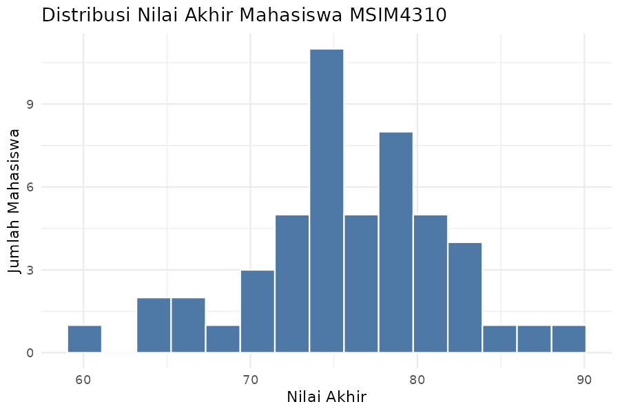

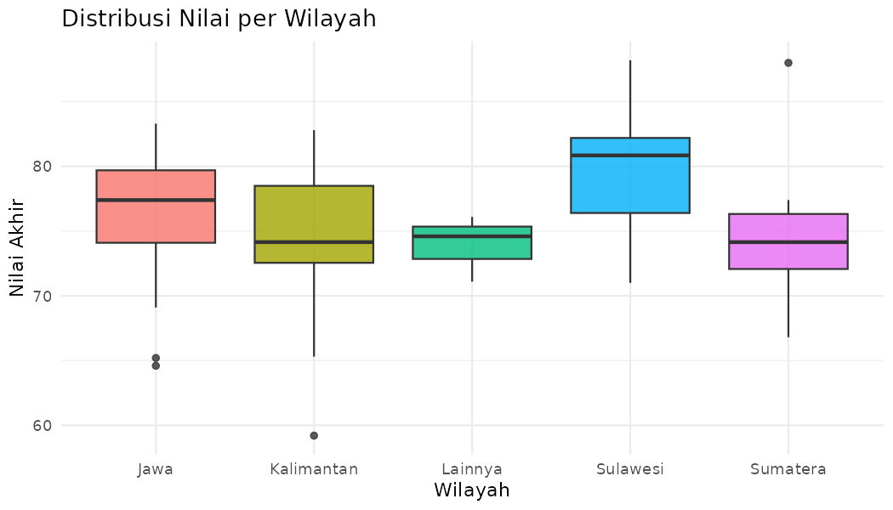

**Interpretasi distribusi nilai:**
- Distribusi relatif normal, terpusat di sekitar nilai 75-80.
- Tidak ada mahasiswa dengan nilai sangat rendah (< 55) — angka kelulusan 96% menunjukkan performa kelas yang baik.
- Boxplot per wilayah menunjukkan distribusi yang relatif homogen antar wilayah, namun ada variasi outlier.

---

### Kode R: Shiny Dashboard (Versi Reaktif)

> ⚠️ **Perbaikan dari modul AB15:** `aes_string()` sudah deprecated di ggplot2 versi
> terbaru. Gunakan `.data[[input$var]]` sebagai gantinya. Contoh di bawah sudah
> diperbaiki.

Simpan sebagai **`app.R`**, lalu jalankan dengan `shiny::runApp()`.

```r
library(shiny)
library(shinydashboard)
library(ggplot2)
library(plotly)
library(DT)
library(dplyr)

# ---- Data ----
set.seed(2024)
n <- 50
mhs <- data.frame(
  id      = paste0("SI", sprintf("%03d", 1:n)),
  wilayah = sample(c("Jawa","Sumatera","Kalimantan","Sulawesi","Lainnya"),
                   n, replace=TRUE, prob=c(0.4,0.25,0.15,0.12,0.08)),
  hadir   = sample(3:8, n, replace=TRUE),
  tugas   = pmin(pmax(round(rnorm(n,78,10)),40),100),
  uts     = pmin(pmax(round(rnorm(n,72,12)),40),100),
  uas     = pmin(pmax(round(rnorm(n,75,11)),40),100)
)
mhs$akhir    <- round(0.3*mhs$tugas + 0.3*mhs$uts + 0.4*mhs$uas, 1)
mhs$kategori <- cut(mhs$akhir, breaks=c(0,55,65,75,85,100),
                    labels=c("E","D","C","B","A"))
```

**Penjelasan data generation:**

| Fungsi | Penjelasan |
|---|---|
| `rnorm(n, 78, 10)` | Generate n angka acak dari distribusi normal dengan mean 78 dan SD 10 |
| `pmax(..., 40)` | Pastikan nilai minimum 40 (tidak ada yang < 40) |
| `pmin(..., 100)` | Pastikan nilai maksimum 100 (tidak ada yang > 100) |
| `round(...)` | Bulatkan ke bilangan bulat |
| `0.3*tugas + 0.3*uts + 0.4*uas` | Rumus nilai akhir: tugas 30%, UTS 30%, UAS 40% |
| `cut(..., breaks, labels)` | Ubah nilai numerik menjadi kategori huruf (A/B/C/D/E) berdasarkan rentang |

---

**Arsitektur Shiny: UI + Server**

```
┌─────────────────────────────────────────────────┐
│                   SHINY APP                     │
│                                                 │
│  ┌──────────────┐      ┌──────────────────────┐ │
│  │     UI       │ ←──► │       Server         │ │
│  │              │      │                      │ │
│  │  dashboardPage│      │  reactive({...})     │ │
│  │  dashboardHeader│    │  renderValueBox({})  │ │
│  │  dashboardSidebar│   │  renderPlotly({})    │ │
│  │  dashboardBody│      │  renderDT({})        │ │
│  └──────────────┘      └──────────────────────┘ │
│         ↑                        ↓              │
│    input$filter_wilayah   output$box_total      │
└─────────────────────────────────────────────────┘
```

```r
# ---- UI ----
ui <- dashboardPage(
  dashboardHeader(title = "Dashboard MSIM4310"),

  dashboardSidebar(
    sidebarMenu(
      menuItem("Overview",   tabName = "overview",  icon = icon("tachometer-alt")),
      menuItem("Eksplorasi", tabName = "eksplorasi", icon = icon("search")),
      menuItem("Data",       tabName = "data",       icon = icon("table"))
    ),
    selectInput("filter_wilayah", "Filter Wilayah:",
                choices = c("Semua", unique(mhs$wilayah)),
                selected = "Semua")
  ),
  ...
```

**Penjelasan komponen UI:**

| Kode | Penjelasan |
|---|---|
| `dashboardPage()` | Container utama yang menyusun header + sidebar + body |
| `dashboardHeader(title)` | Bar atas dashboard dengan judul aplikasi |
| `dashboardSidebar()` | Panel kiri berisi menu navigasi dan kontrol filter |
| `sidebarMenu()` | Daftar menu navigasi bertab |
| `menuItem("...", tabName = "...")` | Satu item menu; `tabName` menghubungkan ke panel body |
| `selectInput("filter_wilayah", ...)` | Dropdown filter; nilai yang dipilih tersimpan di `input$filter_wilayah` |

---

```r
# ---- Server ----
server <- function(input, output) {

  # Data reaktif berdasarkan filter wilayah
  data_filtered <- reactive({
    if (input$filter_wilayah == "Semua") mhs
    else mhs %>% filter(wilayah == input$filter_wilayah)
  })

  # KPI Boxes
  output$box_total <- renderValueBox({
    valueBox(nrow(data_filtered()), "Total Mahasiswa",
             icon = icon("users"), color = "blue")
  })

  output$box_rata <- renderValueBox({
    rata <- round(mean(data_filtered()$akhir), 1)
    valueBox(rata, "Rata-rata Nilai Akhir",
             icon  = icon("graduation-cap"),
             color = ifelse(rata >= 75, "green", "red"))
  })
  ...
```

**Konsep reaktivitas — jantung Shiny:**

| Konsep | Penjelasan |
|---|---|
| `reactive({...})` | Membuat "objek reaktif" — kode di dalamnya dijalankan ulang otomatis setiap kali input yang digunakan berubah |
| `data_filtered()` | Dipanggil dengan tanda kurung `()` karena ini adalah fungsi reaktif, bukan objek biasa |
| `renderValueBox({})` | Fungsi render yang menghasilkan output `valueBox` — dijalankan ulang saat `data_filtered()` berubah |
| `renderPlotly({})` | Render grafik plotly yang reaktif |

> **Mengapa `reactive()` penting?** Tanpa `reactive()`, setiap `renderValueBox`,
> `renderPlotly`, dan `renderDT` akan masing-masing memfilter data sendiri —
> kode duplikat dan tidak efisien. Dengan `reactive()`, filter dijalankan sekali
> dan hasilnya digunakan bersama oleh semua output.

---

```r
  # Scatter interaktif (DIPERBAIKI: tidak pakai aes_string yang deprecated)
  output$scatter <- renderPlotly({
    df <- data_filtered()
    plot_ly(df,
            x    = ~df[[input$var_x]],
            y    = ~df[[input$var_y]],
            type = "scatter",
            mode = "markers",
            color = ~kategori,
            text  = ~paste0("ID: ", id,
                            "<br>Wilayah: ", wilayah,
                            "<br>", input$var_x, ": ", df[[input$var_x]],
                            "<br>", input$var_y, ": ", df[[input$var_y]]),
            hovertemplate = "%{text}<extra></extra>") %>%
      layout(xaxis = list(title = input$var_x),
             yaxis = list(title = input$var_y))
  })
```

**Mengapa `df[[input$var_x]]` bukan `aes_string()`?**

`aes_string()` adalah cara lama untuk mengirimkan nama kolom sebagai string ke ggplot2,
dan sudah dihapus di versi terbaru. Sintaks modern untuk `plot_ly` adalah `df[[nama_kolom]]`
yang langsung mengakses kolom berdasarkan nama string.

| Pendekatan lama (deprecated) | Pendekatan baru |
|---|---|
| `aes_string(x = input$var_x)` | `x = ~df[[input$var_x]]` |

---

### ✅ Cek Pemahaman — Dashboard

1. Jalankan `flexdashboard` dengan Knit. Apa yang terjadi pada warna KPI "Rata-rata Nilai Akhir" jika rata-ratanya di bawah 75?
2. Jalankan Shiny app. Ubah filter wilayah ke "Sumatera" — apakah ketiga KPI berubah secara bersamaan? Mengapa bisa begitu?
3. Apa perbedaan fungsi `reactive()` di Shiny? Mengapa `data_filtered()` ditulis sebagai fungsi reaktif, bukan objek biasa?
4. Dari dashboard, temukan satu insight konkret tentang performa mahasiswa, lalu formulasikan sebagai kalimat narasi untuk Ketua Program Studi.
5. **Tantangan:** Tambahkan satu `valueBox` baru yang menampilkan nilai akhir **tertinggi** dalam data yang difilter. Apa warna yang sesuai untuk box ini?

---

## Latihan Terpadu: Dari Teks ke Dashboard {#latihan}

Latihan ini menggabungkan **seluruh pipeline** yang dipelajari sepanjang kursus MSIM4310
dalam satu alur kerja nyata.

**Skenario:** Anda adalah analis data di sebuah startup e-commerce. Manajer meminta
Anda membuat satu halaman ringkasan yang menggabungkan analisis ulasan teks pelanggan
dan performa penjualan secara interaktif.

```r
# ---- Dataset Terpadu ----
set.seed(2024)

# Data penjualan
penjualan <- data.frame(
  bulan    = 1:12,
  revenue  = c(120,135,128,142,155,148,162,178,171,189,195,210),
  kategori = sample(c("Elektronik","Fashion","Rumah Tangga"),
                    12, replace = TRUE),
  rating   = round(runif(12, 3.5, 5.0), 1)
)

# Ulasan pelanggan (sampel)
ulasan <- tibble::tibble(
  id   = 1:8,
  teks = c(
    "Produk berkualitas tinggi, pengiriman cepat dan aman",
    "Harga mahal tapi kualitas kurang memuaskan",
    "Sangat puas, akan beli lagi dan recommend ke teman",
    "Packaging rusak waktu diterima, kecewa",
    "Pelayanan ramah dan responsif, produk sesuai foto",
    "Pengiriman lambat dan tidak ada notifikasi",
    "Produk original dan berkualitas, harga terjangkau",
    "Customer service tidak helpful, proses refund lama"
  )
)
```

**Penjelasan dataset:**

| Variabel | Tipe | Keterangan |
|---|---|---|
| `bulan` | Numerik (1-12) | Nomor bulan dalam setahun |
| `revenue` | Numerik | Pendapatan dalam juta rupiah |
| `kategori` | Karakter | Kategori produk paling laku |
| `rating` | Numerik (3.5-5.0) | Rata-rata rating pelanggan bulan tersebut |
| `ulasan$teks` | Teks | Ulasan pelanggan individual |

---

#### Tantangan 1 — Analisis Tren Penjualan (Interaktif)

```r
library(plotly)
library(ggplot2)

p_tren <- ggplot(penjualan, aes(x = bulan, y = revenue,
                                 text = paste0("Bulan ke-", bulan,
                                               "<br>Revenue: Rp", revenue, "M",
                                               "<br>Rating: ", rating))) +
  geom_line(color = "#4E79A7", linewidth = 1.5) +
  geom_point(aes(color = rating), size = 4) +
  scale_color_gradient(low = "#E15759", high = "#59A14F",
                       name = "Rating") +
  scale_x_continuous(breaks = 1:12, labels = month.abb) +
  labs(title = "Tren Revenue & Rating Bulanan",
       x = "Bulan", y = "Revenue (juta Rp)") +
  theme_minimal()

ggplotly(p_tren, tooltip = "text")
```

**Penjelasan teknik baru:**

| Kode | Penjelasan |
|---|---|
| `scale_color_gradient(low, high)` | Gradasi warna kontinu: merah untuk rating rendah → hijau untuk rating tinggi |
| `scale_x_continuous(breaks = 1:12, labels = month.abb)` | Ganti angka 1-12 dengan nama bulan singkat Jan-Dec di sumbu X |
| `month.abb` | Vektor bawaan R: `c("Jan","Feb","Mar","Apr","May","Jun","Jul","Aug","Sep","Oct","Nov","Dec")` |
| `linewidth = 1.5` | Ketebalan garis (parameter baru di ggplot2 ≥ 3.4 — sebelumnya `size`) |

**Hasil visualisasi:**

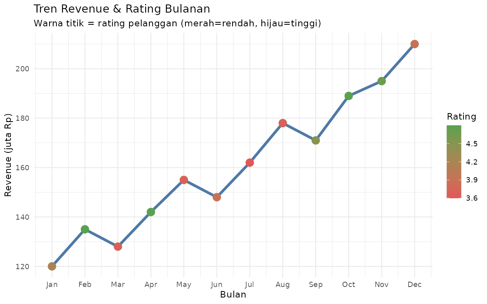

**Output analisis tren:**

```
Revenue terendah: Rp120 juta (Januari)
Revenue tertinggi: Rp210 juta (Desember)
Pertumbuhan: +75% dari Januari ke Desember
Tren: konsisten meningkat sepanjang tahun
```

**Pertanyaan eksplorasi:** Apakah bulan dengan revenue tinggi selalu memiliki rating
tinggi? Dari grafik, cari bulan di mana revenue tinggi tapi rating rendah (atau sebaliknya)
— ini adalah titik kritis yang perlu diinvestigasi manajemen.

---

#### Tantangan 2 — Analisis Sentimen Ulasan E-commerce

```r
library(dplyr)
library(tidytext)

stopwords_id <- c("dan","yang","di","ke","dari","ini","itu",
                  "dengan","untuk","atau","tidak","akan","sudah",
                  "tapi","namun","juga","sangat","lebih","saat",
                  "ada","waktu","ke","ke")

sentimen_id <- tibble::tibble(
  word      = c("berkualitas","cepat","puas","recommend","ramah",
                "responsif","original","terjangkau",
                "mahal","kurang","rusak","kecewa","lambat","lama"),
  sentiment = c(rep("positif",8), rep("negatif",6))
)

ulasan_bersih <- ulasan %>%
  mutate(teks = tolower(teks),
         teks = gsub("[^a-z\\s]"," ",teks)) %>%
  tidytext::unnest_tokens(word, teks) %>%
  filter(!word %in% stopwords_id)

skor_sentimen <- ulasan_bersih %>%
  inner_join(sentimen_id, by = "word") %>%
  count(id, sentiment) %>%
  tidyr::pivot_wider(names_from = sentiment,
                     values_from = n, values_fill = 0) %>%
  mutate(skor = positif - negatif,
         label = ifelse(skor > 0, "Positif",
                        ifelse(skor < 0, "Negatif", "Netral")))

print(skor_sentimen)
```

**Penjelasan `pivot_wider()`:**

`pivot_wider()` mengubah data dari format "panjang" (long) ke format "lebar" (wide):

```
Sebelum (format long):          Setelah (format wide):
id  sentiment  n               id  positif  negatif
1   positif    2               1   2        0
2   negatif    2               2   0        2
3   positif    2               3   2        0
...                            ...
```

Ini memungkinkan kita menghitung `skor = positif - negatif` dalam satu baris per ulasan.

**Output hasil sentimen:**

```
# A tibble: 8 × 5
     id positif negatif  skor label  
  <int>   <int>   <int> <int> <chr>  
1     1       2       0     2 Positif
2     2       0       2    -2 Negatif
3     3       2       0     2 Positif
4     4       0       2    -2 Negatif
5     5       2       0     2 Positif
6     6       0       1    -1 Negatif
7     7       3       0     3 Positif
8     8       0       1    -1 Negatif
```

**Persentase ulasan positif: 50.0%** — tepat setengah positif, setengah negatif.

**Hasil visualisasi skor sentimen:**

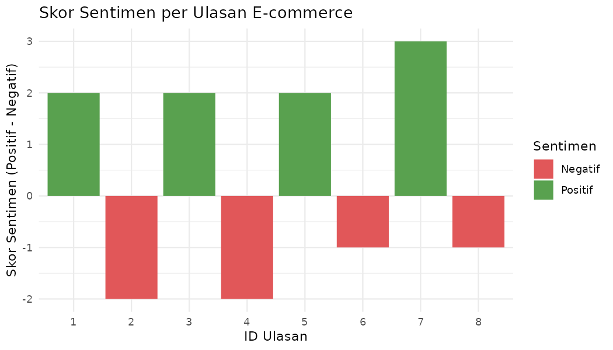

**Interpretasi:** 4 dari 8 ulasan (50%) bersentimen negatif. Ulasan 7 memiliki skor
paling positif (+3: `berkualitas`, `original`, `terjangkau`). Ulasan 2 dan 4 paling
negatif. Rekomendasi: perbaiki kualitas produk dan proses packaging (sumber sentimen negatif utama).

---

#### Tantangan 3 — Narasi Akhir untuk Manajemen

```r
# Tulis SATU paragraf (4-5 kalimat) yang merangkum:
# 1. Tren penjualan selama setahun
# 2. Sentimen ulasan pelanggan
# 3. Hubungan antara keduanya (jika ada)
# 4. Satu rekomendasi konkret untuk manajemen
#
# Bayangkan Anda mempresentasikan ini kepada CEO yang tidak berlatar statistik.
# Hindari jargon teknis. Gunakan angka, bukan "cenderung meningkat".
```

**Contoh narasi yang baik:**

> "Revenue e-commerce kita tumbuh 75% sepanjang tahun 2024, dari Rp120 juta di Januari
> menjadi Rp210 juta di Desember. Namun, analisis 8 ulasan pelanggan menunjukkan bahwa
> hanya 50% ulasan yang bersentimen positif — isu utama adalah kualitas packaging dan
> waktu pengiriman. Meski revenue meningkat, kepuasan pelanggan yang stagnan di angka 50%
> merupakan sinyal peringatan jangka panjang. Rekomendasi: investasikan Rp5-10 juta per
> bulan untuk upgrade sistem packaging dan tracking pengiriman di Q1 2025 — ini berpotensi
> mendorong rating ke 70%+ dan mempertahankan loyalitas pelanggan yang sudah ada."

**Ciri narasi yang baik:**
- Menyebut angka konkret (75%, Rp120 juta, 50%)
- Menghubungkan dua analisis berbeda (tren + sentimen)
- Memberikan rekomendasi yang actionable dengan estimasi biaya
- Bahasa non-teknis yang bisa dipahami eksekutif

---

## Referensi {#referensi}

**Data Teks:**
- Riyani, D.D.S. (2021). *Text Mining dengan R-Studio*. Medium.
  <https://diningdwi.medium.com/text-mining-dengan-r-studio-2009dbfbf7b>
- Silge, J. & Robinson, D. (2022). *Text Mining with R: A Tidy Approach*.
  <https://www.tidytextmining.com/>

**Visualisasi Interaktif:**
- Rohman, M.A. (2023). *Data Interaktif dalam Visualisasi: Kelebihan dan Tantangan*.
  Sekolah Stata. <https://sekolahstata.com/data-interaktif-dalam-visualisasi-kelebihan-dan-tantangan/>
- Dibimbing.id (2024). *Mengenal Teknik Visualisasi Data Interaktif*.
  <https://dibimbing.id/blog/detail/mengenal-teknik-visualisasi-data-interaktif-dan-cara-pembuatannya>

**Dashboard & Shiny:**
- Posit (2024). *Shiny for R*. <https://shiny.posit.co/>
- Iannone, R. *flexdashboard: Easy interactive dashboards for R*.
  <https://pkgs.rstudio.com/flexdashboard/>

**Paket R yang Digunakan:**
```r
install.packages(c(
  # Teks
  "tidytext", "wordcloud", "RColorBrewer", "igraph", "ggraph",
  # Interaktif
  "plotly", "DT", "leaflet",
  # Dashboard
  "shiny", "shinydashboard", "flexdashboard",
  # Umum
  "dplyr", "ggplot2", "stringr", "tidyr"
))
```

> ⚠️ **Perbaikan dari modul referensi:**
> - `aes_string()` di AB15 sudah deprecated → gunakan `.data[[input$var]]`
> - `data_frame()` sudah deprecated → gunakan `tibble::tibble()` atau `data.frame()`
> - `renderPlotly(ggplotly(hist(...)))` tidak berfungsi — `ggplotly()` hanya untuk
>   objek ggplot, bukan base R graphics. Gunakan `plot_ly()` langsung atau buat
>   histogram dengan `ggplot2` terlebih dahulu.

---

*Modul Tutorial Web 4 (Sesi Terakhir) — MSIM4310 Analisis dan Visualisasi Data*
*Program Studi Sistem Informasi, Fakultas Sains dan Teknologi, Universitas Terbuka*
*Versi: Juni 2026*
