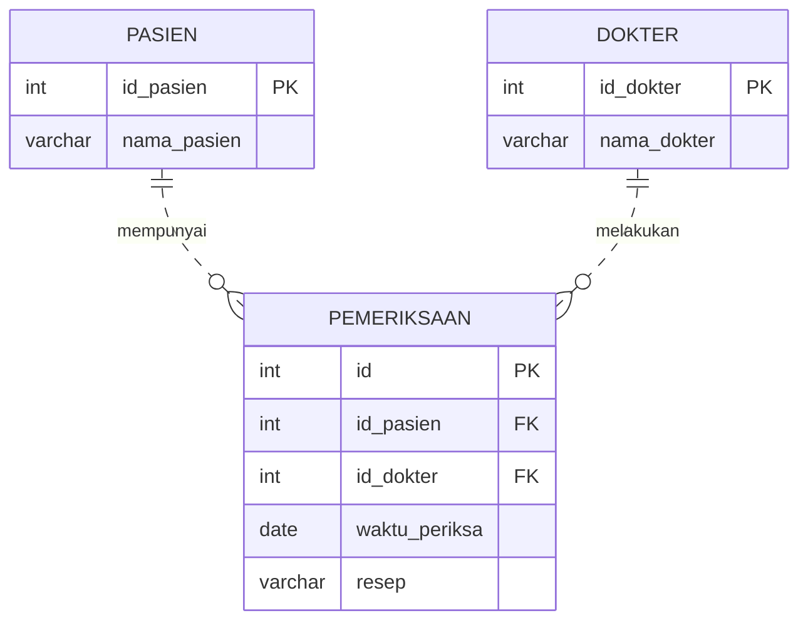

# TUWEB 02 - Dari Konsep Basis Data ke ERD, Normalisasi, dan SQL

- **Mata kuliah:** STSI4105 - Basis Data
- **Cakupan:** Aktivitas Belajar 1-7
- **Durasi langsung:** 90 menit
- **Alat:** yEd Live untuk diagram; Docker dan MariaDB untuk SQL; phpMyAdmin opsional
- **Dasar:** RAT dan sumber belajar UT yang diunggah; daftar rujukan ada pada Bagian 12.

Dokumen ini berisi pembahasan untuk dipakai saat tutorial, contoh yang dapat dijelaskan, kegiatan mahasiswa, dan arah jawaban. Bagian bertanda **Catatan tutor** menjelaskan penyesuaian dari sumber. Langkah instalasi tersedia dalam [LAB_DOCKER.md](LAB_DOCKER.md) dan dilakukan sebelum tutorial.

## Daftar isi

1. [Alur 90 menit dan capaian](#1-alur-90-menit-dan-capaian)
2. [AB 1 - Orientasi](#2-ab-1---orientasi)
3. [AB 2 - Basis data dan sistem basis data](#3-ab-2---basis-data-dan-sistem-basis-data)
4. [AB 3 - Model data, kunci, dan komponen ERD](#4-ab-3---model-data-kunci-dan-komponen-erd)
5. [AB 4 - Membuat ERD rumah sakit di yEd Live](#5-ab-4---membuat-erd-rumah-sakit-di-yed-live)
6. [AB 5 - Normalisasi: UNF hingga 3NF](#6-ab-5---normalisasi-unf-hingga-3nf)
7. [AB 6 - Redundansi dan denormalisasi](#7-ab-6---redundansi-dan-denormalisasi)
8. [AB 7 - DDL dan DML dengan MariaDB](#8-ab-7---ddl-dan-dml-dengan-mariadb)
9. [Latihan dan arah jawaban](#9-latihan-dan-arah-jawaban)
10. [Penutup dan persiapan TUWEB 03](#10-penutup-dan-persiapan-tuweb-03)
11. [Catatan tutor tentang sumber](#11-catatan-tutor-tentang-sumber)
12. [Rujukan](#12-rujukan)

## 1. Alur 90 menit dan capaian

### 1.1 Capaian

Setelah tutorial ini, mahasiswa diharapkan dapat:

- Membedakan data, basis data, DBMS, dan sistem basis data.
- Menjelaskan tiga level abstraksi data.
- Menentukan entitas, atribut, kunci, relasi, dan kardinalitas.
- Mendeskripsikan komponen ERD, memilih penggunaannya, dan memberi contoh sesuai aturan kasus.
- Menggunakan lima tahap pembuatan ERD.
- Menjelaskan anomali serta perubahan tabel dari UNF ke 3NF.
- Membedakan penggunaan FK dengan duplikasi fakta yang bermasalah.
- Menjelaskan alasan dan risiko denormalisasi.
- Membedakan DDL dan DML serta menjalankan operasi dasar pada tabel contoh.

Capaian tersebut merupakan rumusan pendamping dari RAT AB 1-7. Pembahasan variasi model ER disediakan untuk dibaca, sedangkan latihan langsung berfokus pada kunci dan kardinalitas.

### 1.2 Jadwal tutorial

| Menit | Durasi | Pembahasan | Kegiatan utama |
| --- | --- | --- | --- |
| 0-5 | 5 | AB 1: orientasi | Peta belajar, aturan kelas, pertanyaan awal |
| 5-15 | 10 | AB 2: konsep | Bandingkan daftar terpisah dengan basis data bersama |
| 15-28 | 13 | AB 3: model, kunci, dan komponen ERD | Kenali komponen, tentukan identitas, serta baca hubungan dokter-pasien |
| 28-48 | 20 | AB 4: desain ERD | Contoh pemodelan, latihan sebagian di yEd Live, dan umpan balik |
| 48-68 | 20 | AB 5: normalisasi | Telusuri faktur UNF-3NF dan alasan pemisahan |
| 68-74 | 6 | AB 6: redundansi | Putuskan apakah total faktur perlu disimpan |
| 74-84 | 10 | AB 7: SQL | Satu tabel demo untuk DDL dan CRUD |
| 84-90 | 6 | Penutup | Cek pemahaman 3 menit; pertanyaan/cadangan 3 menit |

**Total: 90 menit.** Bahan bacaan lebih luas daripada penjelasan lisan. Jangan membaca setiap bagian kata demi kata saat kelas. Instalasi Docker dan pembuatan seluruh tabel tidak dilakukan dari awal pada sesi langsung.

### 1.3 Persiapan tutor

1. Jalankan MariaDB sebelum kelas. Periksa `docker compose ps` dan `SHOW TABLES;`.
2. Buka yEd Live serta diagram rumah sakit. Simpan salinan awal untuk latihan.
3. Siapkan contoh faktur pada Bagian 6.
4. Buka [SQL demo](sql/demo/01-ddl-dml.sql); jalankan tahap demi tahap saat menerangkan.
5. Siapkan aturan kehadiran, diskusi, tugas, dan pengumpulan dari LMS kelas.
6. Jika alat bermasalah lebih dari 3 menit, gunakan bahan yang telah disiapkan untuk menjelaskan hasil dan catat kendala untuk tindak lanjut.

## 2. AB 1 - Orientasi

**Dasar sumber:** RAT hlm. 1; slide AB 1.

Basis data membantu kita menyimpan data dengan aturan yang jelas dan mengambil informasi yang dibutuhkan. Namun, tabel yang dapat menyimpan data belum tentu mempunyai rancangan yang baik. Kita perlu memahami objek yang dicatat, identitasnya, hubungannya, dan aturan perubahannya.

Alur belajar tiga TUWEB:

| Pertemuan | Pertanyaan yang akan dijawab |
| --- | --- |
| TUWEB 02 | Data apa yang disimpan, bagaimana hubungannya, dan bagaimana tabel dasar dibuat? |
| TUWEB 03 | Bagaimana SQL menghasilkan informasi dan mengapa transaksi serta distribusi data diperlukan? |
| TUWEB 04 | Bagaimana konsistensi, replikasi, dan penggunaan data melalui aplikasi dibuktikan? |

**Pertanyaan pembuka:** “Rumah sakit ingin mengetahui pasien yang pernah diperiksa seorang dokter. Data apa yang perlu dicatat?”

**Arah jawaban:** identitas pasien, identitas dokter, serta peristiwa pemeriksaan yang menghubungkan keduanya. Nama saja tidak cukup untuk menyimpan hubungan dengan pasti.

**Catatan tutor:** RAT menempatkan tata tertib dan etika pada AB 1. Jelaskan aturan yang berlaku pada kelas. Jangan menambah bobot nilai, tenggat, atau bentuk tugas yang belum ditetapkan. Slide AB 1 merupakan ikhtisar teknis lintas topik; gunakan sebagai peta, kemudian bahas rincian menurut AB terkait.

## 3. AB 2 - Basis data dan sistem basis data

**Dasar sumber:** RAT hlm. 2; AK02 hlm. 2-13.

### 3.1 Istilah dasar

| Istilah | Pengertian | Contoh pada kelas |
| --- | --- | --- |
| Data | Representasi fakta tentang objek atau kejadian | ID pasien, nama, tanggal pemeriksaan |
| Basis data | Kumpulan data yang diatur beserta hubungan dan aturan yang mendukung kebutuhan tertentu | Tabel pasien, dokter, dan pemeriksaan |
| DBMS | Perangkat lunak untuk mendefinisikan, menyimpan, membaca, dan mengelola data | MariaDB |
| Sistem basis data | Lingkungan yang mencakup data, DBMS, perangkat, pengguna, dan cara penggunaannya | MariaDB dalam container yang dipakai mahasiswa melalui terminal |
| Sistem informasi | Gabungan komponen yang menghasilkan informasi untuk kegiatan organisasi | Sistem pendaftaran dan pemeriksaan rumah sakit |

Docker menjalankan lingkungan perangkat lunak. Docker bukan DBMS. phpMyAdmin merupakan antarmuka administrasi, sedangkan MariaDB melakukan pengelolaan basis data. yEd Live menggambar model; yEd Live tidak otomatis membuat tabel MariaDB dari diagram latihan.

### 3.2 Mengapa daftar terpisah dapat bermasalah?

Misalkan petugas pendaftaran dan petugas pemeriksaan masing-masing menyimpan daftar pasien.

| ID pasien | Daftar pendaftaran | Daftar pemeriksaan |
| --- | --- | --- |
| 1 | Pasien A, Jl. Contoh 1 | Pasien A, Jl. Contoh 1 |
| 2 | Pasien B, Jl. Contoh 2 | Pasien B, Jl. Contoh 2 |

Pasien A pindah alamat. Daftar pendaftaran diperbarui, tetapi daftar pemeriksaan masih berisi alamat lama. Dua petugas sekarang membaca fakta berbeda untuk pasien yang sama.

Rancangan basis data dapat mengurangi masalah itu dengan menyimpan alamat pada tabel pasien dan menggunakan ID pasien pada tabel kegiatan. Pembatasan akses serta aturan pembaruan tetap diperlukan. Memindahkan data ke DBMS saja tidak otomatis memperbaiki rancangan yang buruk.

### 3.3 Tujuan dan manfaat

| Tujuan pada sumber | Contoh manfaat |
| --- | --- |
| Kecepatan dan kemudahan | Data pasien dapat dicari berdasarkan ID |
| Efisiensi ruang | Nama dan alamat tidak perlu disalin ke setiap pemeriksaan |
| Akurasi | Tipe data dan batasan membantu memeriksa input |
| Keamanan | Pengguna mendapat akses sesuai kebutuhan |
| Konsistensi | Fakta yang sama tidak mempunyai beberapa nilai yang bertentangan |
| Pemakaian bersama | Pengguna yang berwenang dapat mengakses data yang diperlukan |
| Standardisasi | Nama kolom, kode, dan format data disepakati |
| Ketersediaan | Data aktif dan riwayat diatur sesuai kebutuhan akses |
| Kelengkapan | Data yang diperlukan untuk proses bisnis dicatat |

Keuntungan tersebut mempunyai biaya: perangkat, penyimpanan, pengelolaan, perpindahan dari sistem lama, dan pelatihan pengguna. Karena itu, pilihan DBMS perlu mempertimbangkan kebutuhan sistem.

Contoh penerapan pada sumber meliputi kepegawaian, persediaan, akuntansi, reservasi, dan layanan pelanggan.

### 3.4 Komponen dan tingkatan data

Sistem basis data melibatkan perangkat keras, sistem operasi, DBMS, basis data, pengguna, serta prosedur penggunaan. Pada lab, perangkat mahasiswa menjalankan Docker; container menjalankan MariaDB; pengguna mengirim SQL melalui terminal atau phpMyAdmin.

Pada model relasional, satu tabel terdiri dari kolom dan baris. Kolom menyatakan atribut; satu baris menyatakan satu catatan sesuai arti tabel. Kumpulan tabel yang saling berkaitan berada dalam basis data.

Contoh operasi dasar:

- Membuat/menghapus database dan tabel.
- Menambah data: `INSERT`.
- Membaca data: `SELECT`.
- Mengubah data: `UPDATE`.
- Menghapus data: `DELETE`.

### 3.5 Tiga level abstraksi

| Level | Pertanyaan | Contoh |
| --- | --- | --- |
| Fisik | Bagaimana data disimpan dan diakses? | Berkas database, halaman penyimpanan, dan indeks |
| Konseptual/logis | Data apa yang ada dan bagaimana hubungannya? | Tabel pasien berhubungan dengan tabel pemeriksaan |
| Pandangan pengguna | Data apa yang diperlukan pengguna tertentu? | Petugas pendaftaran melihat identitas; dokter melihat data pemeriksaan yang diizinkan |

**Diskusi:** jika dokter dan petugas pendaftaran mempunyai tampilan berbeda, apakah perlu dua salinan seluruh data pasien?

**Arah jawaban:** tidak selalu. Tampilan dan hak akses dapat berbeda dengan sumber data yang sama.

## 4. AB 3 - Model data, kunci, dan komponen ERD

**Dasar sumber:** RAT hlm. 2; AK03 hlm. 2-6; simbol pada Panduan Praktik 1 hlm. 8-9.

### 4.1 Apa yang dijelaskan model data?

Model data menjelaskan data, hubungan, dan batasan. Contoh batasan: satu pemeriksaan harus mengacu ke pasien yang ada. Model memungkinkan pengembang dan pengguna membahas kebutuhan sebelum tabel diimplementasikan.

| Model pada slide | Bentuk hubungan dasar | Contoh pemahaman |
| --- | --- | --- |
| Hierarki | Struktur seperti pohon | Induk dan anak dalam susunan bertingkat |
| Jaringan | Catatan dapat mempunyai beberapa hubungan | Objek terhubung melalui beberapa jalur |
| Relasional | Data diatur dalam tabel dan dikaitkan melalui nilai kunci | Pasien dan pemeriksaan dihubungkan dengan ID pasien |

RAT juga membedakan model berbasis objek, record, dan fisik. Model ER menjelaskan objek dan hubungannya pada tingkat konseptual. Model relasional menjelaskan struktur tabel. Model fisik membahas implementasi penyimpanan. Ini merupakan tingkat atau pendekatan pemodelan; jangan memperlakukannya sebagai tiga nama produk DBMS.

### 4.2 Desain ERD dan komponen penyusunnya

**ERD (Entity Relationship Diagram)** merupakan gambaran tentang objek yang datanya perlu dicatat, sifat objek, hubungan antarobjek, dan aturan hubungan tersebut. Desain ERD dimulai dari kebutuhan dan aturan bisnis, lalu dipakai untuk memeriksa rancangan sebelum tabel dibuat.

Secara tepat, pasien dengan ID 1 merupakan satu **entitas/instance**, sedangkan `Pasien` pada diagram mewakili **tipe entitas**. Dalam pembahasan sehari-hari, tipe entitas sering disebut singkat sebagai entitas. Kotak `Pasien` bukan berarti hanya ada satu pasien dalam sistem.

#### 4.2.1 Komponen: deskripsi, penggunaan, dan contoh

| Komponen | Deskripsi | Penggunaan dalam desain | Contoh |
| --- | --- | --- | --- |
| Entitas kuat | Tipe objek dengan identitas yang dapat ditentukan dari atributnya sendiri | Memodelkan objek yang perlu dibedakan satu per satu dan mempunyai data deskriptif | `Pasien`, diidentifikasi oleh `id_pasien`; ID 1 adalah Pasien A |
| Entitas lemah | Tipe objek yang identitas lengkapnya memerlukan kunci entitas pemilik bersama pembeda lokal | Memodelkan bagian milik suatu objek ketika nomor lokal dapat berulang pada pemilik berbeda | Contoh tambahan: `BarisFaktur` dengan identitas `(no_faktur, no_baris)`; baris 1 pada F001 berbeda dari baris 1 pada F002 |
| Atribut | Sifat objek atau hubungan yang perlu dicatat | Menetapkan informasi yang diperlukan; letakkan pada objek/peristiwa yang menentukan nilainya | `nama_pasien` milik Pasien; `waktu_periksa` dan `resep` milik peristiwa Pemeriksaan |
| Atribut kunci/identifier | Atribut atau gabungan atribut yang membedakan setiap instance | Mencegah rancangan bergantung pada nama yang dapat sama atau berubah | `id_dokter` membedakan Dokter A dan Dokter B; pilihan PK/FK dirinci pada Bagian 4.3 |
| Relasi/relationship | Hubungan bermakna antara tipe entitas | Menjelaskan keterkaitan dengan nama tindakan, sebelum memutuskan penempatan FK | Dokter **memeriksa** Pasien; Administrator **mencatat** pendaftaran |
| Relasi identifikasi untuk entitas lemah | Hubungan yang menyertakan identitas pemilik dalam identitas anak | Memastikan pembeda lokal anak dibaca dalam lingkup pemiliknya | Faktur **memiliki** BarisFaktur; nomor baris saja tidak cukup sebagai identitas |
| Kardinalitas maksimum | Batas satu atau banyak pada setiap arah hubungan | Menentukan 1:1, 1:N, atau M:N dan kebutuhan tabel penghubung | Satu dokter dapat mempunyai banyak pemeriksaan; satu pemeriksaan hanya mempunyai satu dokter pada lab |
| Partisipasi minimum/optionalitas | Batas minimum nol atau satu pada setiap arah hubungan | Menjelaskan apakah objek wajib mempunyai hubungan atau boleh belum terhubung | Pasien boleh belum diperiksa: minimum 0; pemeriksaan wajib mempunyai pasien: minimum 1 |
| Entitas asosiasi/peristiwa | Objek yang mewakili hubungan dan dapat menyimpan atribut hubungan | Memetakan M:N atau mencatat kejadian berulang dengan identitas per kejadian | `pasien_dokter` menyimpan ID pemeriksaan, dua FK, waktu, dan resep; satu pasangan dokter-pasien dapat muncul beberapa kali |

Contoh `BarisFaktur` menggunakan nomor baris untuk menjelaskan entitas lemah. Skema faktur pada lab memakai `transaksi` dengan PK `(no_faktur, kode_barang)` berdasarkan asumsi satu barang sekali per faktur. Keduanya merupakan pilihan model berbeda; jangan menambahkan `no_baris` ke SQL lab tanpa meninjau asumsi dan kuncinya.

**Istilah penghubung ke implementasi:** skema adalah definisi struktur beserta batasan; tuple/record adalah satu baris; domain adalah himpunan nilai yang diperbolehkan. FK merupakan mekanisme referensi pada skema relasional, sehingga tidak harus ditampilkan sebagai atribut terpisah pada ERD konseptual.

#### 4.2.2 Simbol dan pilihan notasi

Panduan Praktik 1 hlm. 8-9 menampilkan entitas, entitas dengan atribut, entitas lemah, relationship, relationship lemah, atribut, multivalue, atribut PK, derived attribute, dan penanda hubungan. Gunakan legenda agar arti bentuk jelas, terutama ketika berpindah dari diagram konseptual ke diagram tabel.

| Komponen | Bentuk dalam notasi Chen yang umum diajarkan | Cara penggunaannya |
| --- | --- | --- |
| Entitas kuat | Persegi panjang | Beri nama tipe objek, misalnya `Pasien` |
| Entitas lemah | Persegi panjang bergaris ganda | Sertakan pemilik, pembeda lokal, dan relasi identifikasinya |
| Relasi | Belah ketupat yang terhubung ke entitas | Beri nama tindakan, misalnya `memeriksa` |
| Relasi identifikasi/relationship lemah | Belah ketupat bergaris ganda | Hubungkan entitas lemah dengan pemilik identitasnya |
| Atribut biasa | Oval | Hubungkan ke entitas atau relasi yang memiliki atribut |
| Atribut kunci | Nama atribut digarisbawahi dalam oval | Tandai atribut pengenal; kunci gabungan menandai beberapa atribut |
| Pembeda lokal/partial key | Nama atribut dengan garis bawah putus-putus | Contoh `no_baris`; identitas lengkap tetap memerlukan `no_faktur` |
| Atribut multivalue | Oval bergaris ganda | Contoh beberapa nomor telepon; bukan satu kolom berisi daftar nomor |
| Atribut turunan | Oval bergaris putus-putus | Contoh umur yang dihitung dari tanggal lahir |
| Partisipasi | Garis tunggal untuk parsial, garis ganda untuk total | Bedakan boleh tidak berhubungan dengan wajib terlibat sedikitnya sekali |

Dalam **Crow's Foot/Martin**, entitas umumnya berupa kotak dengan daftar atribut; hubungan berupa garis dengan penanda pada kedua ujung. Atribut tidak perlu digambar sebagai oval. Satu garis berarti batas satu, kaki gagak berarti banyak, dan lingkaran berarti minimum nol. Kombinasi penanda dijelaskan pada Bagian 4.4.

**Entitas dengan atribut** pada palet merupakan cara menampilkan entitas bersama daftar atribut dalam satu kotak, bukan jenis entitas bisnis baru. Panah biasa tidak cukup untuk menyatakan kardinalitas. ERD juga tidak menyatakan urutan proses seperti diagram alir.

Gunakan Chen saat menjelaskan perbedaan komponen konseptual. Untuk latihan yEd Live, gunakan Crow's Foot/Martin atau kotak berlabel seperti GraphML yang disediakan. Cantumkan notasi yang dipilih dan baca arti hubungan dalam dua arah. Jangan menggunakan arti garis putus-putus dari satu notasi untuk menafsirkan notasi lain.

#### 4.2.3 Jenis atribut dan keputusan penggunaannya

| Jenis atribut | Deskripsi | Kapan digunakan | Contoh dan pemetaan |
| --- | --- | --- | --- |
| Sederhana/simple | Tidak diuraikan lagi untuk kebutuhan model | Ketika satu nilai sudah memenuhi kebutuhan pencatatan | `jenis_kelamin` pada lab; nilai yang diperbolehkan tetap perlu aturan domain |
| Komposit/composite | Dapat diuraikan menjadi beberapa bagian bermakna | Ketika bagian perlu dicari, diurutkan, atau diperbarui terpisah | Tambahan contoh: alamat terdiri dari jalan, kota, dan kode pos; jika diperlukan, petakan ke kolom masing-masing |
| Bernilai tunggal/single-valued | Satu instance mempunyai paling banyak satu nilai atribut pada keadaan yang dimodelkan | Ketika satu nilai sudah mencukupi untuk satu objek | Satu `nama_pasien` pada model lab |
| Bernilai banyak/multivalued | Satu instance dapat mempunyai beberapa nilai atribut | Ketika beberapa nilai harus dicatat terpisah dan lengkap | Tambahan contoh: beberapa nomor kontak pasien; petakan ke tabel `kontak_pasien(id_pasien, nomor_kontak)` dengan kunci/batasan yang sesuai |
| Tersimpan/stored | Nilainya dicatat sebagai fakta dasar | Ketika nilai diperlukan sebagai dasar pengolahan atau bukti kejadian | `waktu_periksa` dan `harga_transaksi` pada lab disimpan sebagai fakta kejadian |
| Turunan/derived | Nilainya diperoleh dari atribut lain dengan aturan perhitungan | Ketika nilai dapat dihitung dan perlu mengikuti perubahan waktu/data dasar | Tambahan contoh: umur dihitung dari tanggal lahir dan tanggal acuan; total faktur dihitung dari jumlah dan harga transaksi |

Kategori tersebut mengukur aspek berbeda. Atribut dapat sekaligus sederhana dan bernilai tunggal. Atribut komposit tidak otomatis multivalue: satu alamat dapat mempunyai beberapa bagian tanpa berarti pasien mempunyai beberapa alamat.

**Penempatan atribut:** tanggal pemeriksaan berbeda antarperistiwa sehingga ditempatkan pada Pemeriksaan, bukan pada Pasien atau Dokter. Menaruh resep langsung pada Pasien akan mengaburkan pemeriksaan mana yang menghasilkan resep tersebut.

Contoh tanggal lahir, kontak, dan alamat terurai merupakan tambahan penjelasan; kolom tersebut belum ditambahkan ke SQL lab. Atribut multivalue pada model konseptual perlu pemetaan relasional, bukan langsung disimpan sebagai teks berisi daftar.

#### 4.2.4 Dari ERD konseptual ke implementasi

| Tahap desain | Fokus | Hasil contoh |
| --- | --- | --- |
| Konseptual | Makna objek, atribut penting, hubungan, dan aturan bisnis | Pasien, Dokter, dan hubungan memeriksa beserta waktu pemeriksaan |
| Logis relasional | Pemetaan ke tabel, kunci, FK, dan struktur hubungan | `pasien`, `dokter`, serta `pasien_dokter` dengan identitas pemeriksaan |
| Fisik | Tipe data dan pilihan implementasi pada DBMS | `INT`, `DATE`, `VARCHAR`, `NOT NULL`, FK, dan InnoDB dalam MariaDB |

Ketiga baris ini menjelaskan tahapan pengembangan rancangan. Level fisik, konseptual, dan pandangan pengguna pada Bagian 3.5 menjelaskan abstraksi akses data; kedua pembagian tersebut berkaitan tetapi mempunyai tujuan penjelasan berbeda.

### 4.3 Jenis kunci

| Kunci | Arti | Contoh |
| --- | --- | --- |
| Superkey | Atribut atau gabungan atribut yang dapat mengidentifikasi baris secara unik | ID pasien bersama nama pasien |
| Candidate key | Superkey minimal; tidak ada bagian yang dapat dihapus tanpa kehilangan keunikan | ID pasien |
| Primary key/PK | Kunci kandidat yang dipilih sebagai identitas utama | `pasien.id_pasien` |
| Foreign key/FK | Atribut yang mengacu ke kunci unik/utama pada tabel lain | `pasien_dokter.id_pasien` |
| Kunci gabungan | Kunci yang terdiri dari lebih dari satu atribut | `(no_faktur, kode_barang)` dengan asumsi satu barang sekali per faktur |

Kunci kandidat ditentukan oleh aturan data, bukan karena kolomnya diberi nama “kode”. Nama pasien dapat sama dan dapat berubah. Karena itu, nama tidak cocok sebagai PK dalam kasus ini.

### 4.4 Kardinalitas, partisipasi, dan identifikasi

#### 4.4.1 Kardinalitas maksimum: 1:1, 1:N, dan M:N

| Bentuk | Deskripsi dan penggunaan | Contoh serta konsekuensi desain |
| --- | --- | --- |
| 1:1 | Maksimum satu pada kedua arah; dipakai jika dua objek mempunyai hubungan berpasangan | Tambahan asumsi: satu pasien mempunyai paling banyak satu kartu aktif dan satu kartu aktif milik satu pasien. Pada tabel terpisah, FK yang diberi UNIQUE dapat membatasi maksimum satu; minimum partisipasi ditetapkan terpisah |
| 1:N | Satu induk dapat mempunyai banyak anak, tetapi satu anak mengacu paling banyak ke satu induk | Dokter ke Pemeriksaan; letakkan `id_dokter` sebagai FK di `pasien_dokter`. Pada lab, FK wajib terisi sehingga satu pemeriksaan mempunyai tepat satu dokter |
| M:N | Banyak objek pada kedua sisi dapat saling berhubungan | Dokter memeriksa banyak pasien dan pasien diperiksa banyak dokter; gunakan tabel peristiwa `pasien_dokter` untuk skema relasional |

Angka 1 pada 1:N menyatakan batas maksimum satu, bukan otomatis berarti setiap objek wajib mempunyai hubungan. Minimum perlu dibaca dari aturan partisipasi.

#### 4.4.2 Minimum dan maksimum pada ujung hubungan

| Notasi min..max | Deskripsi | Penanda Crow's Foot/Martin | Penggunaan dan contoh |
| --- | --- | --- | --- |
| 0..1 | Boleh tidak ada, maksimum satu | Lingkaran dan satu garis | Contoh tambahan kartu aktif: satu pasien boleh belum mempunyai kartu aktif |
| 1..1 | Wajib tepat satu | Dua garis | Setiap pemeriksaan pada lab mempunyai tepat satu pasien |
| 0..N | Boleh tidak ada atau banyak | Lingkaran dan kaki gagak | Satu pasien boleh belum diperiksa atau mempunyai beberapa pemeriksaan |
| 1..N | Wajib sedikitnya satu, boleh banyak | Satu garis dan kaki gagak | Asumsi bisnis tambahan: faktur yang sudah diterbitkan harus mempunyai sedikitnya satu detail |

Penanda di dekat suatu entitas menyatakan berapa instance entitas **di ujung itu** yang dapat berkaitan dengan satu instance pada sisi seberangnya. Baca satu arah terlebih dahulu, kemudian balik arah baca. Contoh: dari satu pasien, lihat penanda di ujung Pemeriksaan untuk mengetahui jumlah pemeriksaannya.

Dalam notasi Chen, partisipasi total memakai garis ganda dan parsial memakai garis tunggal. Pada Crow's Foot/Martin, minimum diwujudkan melalui penanda ujung. Aturan faktur terbit minimal satu detail tidak otomatis dijamin hanya dengan FK; membutuhkan validasi proses bisnis atau mekanisme tambahan.

Penanda **tidak spesifik**, **1-tidak spesifik**, dan **N-tidak spesifik** pada tabel simbol sumber belum menyatakan semua batas hubungan. Jangan mengartikan tidak spesifik sebagai nol. Lengkapi batas yang belum dinyatakan berdasarkan aturan kasus sebelum diagram dijadikan dasar implementasi.

Relasi dokter-pasien M:N perlu dipetakan menjadi tabel penghubung. Pada lab, `pasien_dokter` menyimpan satu peristiwa pemeriksaan. Setiap baris mengacu tepat ke satu dokter dan satu pasien. Satu dokter/pasien boleh belum mempunyai pemeriksaan, sehingga sisi peristiwanya memakai 0..N.

#### 4.4.3 Identifikasi berbeda dari wajib berhubungan

Pada ERD logis yang menilai identifikasi dari komposisi kunci, hubungan **identifying** memasukkan kunci induk ke identitas/PK anak. Hubungan **non-identifying** tetap memiliki FK, tetapi identitas anak ditentukan oleh kunci lain. Gunakan arti ini pada contoh diagram relasional berikut.

| Keputusan | Penggunaan | Contoh |
| --- | --- | --- |
| Identifying | Identitas anak memerlukan identitas induk | `BarisFaktur` diidentifikasi dengan `(no_faktur, no_baris)`; `no_faktur` merupakan bagian PK sekaligus FK |
| Non-identifying | Anak mempunyai identitas sendiri; FK menyatakan referensi | `pasien_dokter` mempunyai PK `id`; `id_pasien` dan `id_dokter` merupakan FK yang tidak menjadi bagian PK |

Pada lab, FK Pemeriksaan wajib terisi walaupun tidak menjadi bagian PK. Jadi, **FK NOT NULL tidak otomatis membuat hubungan identifying**. FK juga tidak berarti atribut deskriptif induk harus disalin ke anak.

### 4.5 Varian model ER - bacaan singkat

Topik berikut tercantum pada RAT, tetapi tidak dijelaskan lengkap dalam slide unggahan. Contoh di sini merupakan tambahan tutor.

| Konsep | Penjelasan dan contoh |
| --- | --- |
| Entitas kuat | Mempunyai identitas sendiri, misalnya pasien dengan ID pasien |
| Entitas lemah | Identitas bergantung pada pemilik; detail faktur dapat diidentifikasi dengan nomor faktur dan nomor baris |
| Atribut multivalue | Satu objek mempunyai beberapa nilai, misalnya beberapa nomor kontak; perlu rancangan relasional yang sesuai |
| Atribut turunan | Nilainya dihitung dari atribut lain, misalnya umur dari tanggal lahir |
| Relasi rekursif | Objek berhubungan dengan objek sejenis, misalnya pegawai membawahi pegawai |
| Relasi ternary | Hubungan melibatkan tiga tipe entitas; misalnya supplier memasok barang untuk proyek tertentu |
| Spesialisasi | Kelompok umum dipisah menjadi subkelompok; pegawai menjadi dokter atau administrator |
| Generalisasi | Subkelompok dipandang sebagai kelompok umum dengan atribut bersama |
| Agregasi | Sebuah relasi beserta entitas yang terlibat dipandang sebagai satu kesatuan untuk relasi lain; penugasan dokter pada unit diperiksa administrator |

Relasi ternary tidak boleh selalu diganti tiga relasi binary tanpa memeriksa apakah maknanya tetap sama. Pendalaman model ER lanjutan mengikuti BMP yang digunakan kelas.

## 5. AB 4 - Membuat ERD rumah sakit di yEd Live

**Dasar sumber:** RAT hlm. 2-3; Panduan Praktik 1 hlm. 8-15.

### 5.1 Narasi kasus

Rumah sakit mempunyai dokter dan pasien. Pasien mendaftar melalui administrator. Pasien dapat diperiksa beberapa dokter, dan dokter dapat memeriksa beberapa pasien. Pada pemeriksaan, waktu dan resep dicatat. Administrator juga dapat menangani penyampaian data kepada dokter.

Narasi ini disusun ulang dari panduan. Relasi administrator dalam panduan mempunyai beberapa penjelasan yang tidak konsisten. Untuk latihan ini, gunakan aturan lab berikut secara terbuka:

1. Setiap pendaftaran mengacu ke satu pasien dan satu administrator.
2. Setiap pemeriksaan mengacu ke satu pasien dan satu dokter.
3. Pasangan dokter-pasien boleh mempunyai lebih dari satu pemeriksaan pada waktu berbeda.
4. Catatan dokter-administrator menghubungkan satu dokter dengan satu administrator. Makna kegiatan ini disederhanakan mengikuti tabel penghubung pada panduan SQL.
5. Pasien, dokter, atau administrator boleh sudah dicatat sebelum mempunyai kegiatan terkait.

Asumsi di atas merupakan keputusan latihan, bukan satu-satunya model rumah sakit yang benar.

### 5.2 Lima tahap inti

| Tahap | Pekerjaan | Hasil pada kasus |
| --- | --- | --- |
| 1 | Identifikasi entitas | Dokter, pasien, administrator |
| 2 | Tentukan atribut dan kunci | ID dokter/pasien/admin serta atribut deskriptif |
| 3 | Identifikasi relasi dan rancang referensi | Memeriksa, mendaftar, dan penyampaian data |
| 4 | Tetapkan kardinalitas serta minimum partisipasi | M:N pada gambaran awal; 1 ke 0..N melalui tabel kegiatan |
| 5 | Lengkapi atribut dan sempurnakan model | Waktu pemeriksaan, resep, kunci peristiwa, serta daftar asumsi |

PK/FK merupakan bagian pemetaan ke skema relasional. Pada model konseptual, hubungan dapat digambar lebih dahulu sebelum semua kolom FK ditulis.

#### 5.2.1 Pembagian 20 menit pembahasan desain ERD

| Menit sesi | Durasi | Kegiatan |
| --- | --- | --- |
| 28-33 | 5 | Tinjau komponen inti: entitas, atribut/kunci, relasi, dan min..max; kaitkan dengan narasi rumah sakit |
| 33-37 | 4 | Tutor memodelkan Pasien-Dokter-Pemeriksaan dan menjelaskan penempatan waktu serta resep |
| 37-46 | 9 | Mahasiswa melengkapi diagram kecil di yEd Live sesuai Bagian 5.5 |
| 46-48 | 2 | Baca hubungan dalam dua arah dan koreksi satu kesalahan desain bersama |

Blok AB 3 selama 13 menit memberi dasar model, kunci, dan komponen. Pada blok AB 4, komponen tersebut dipakai untuk merancang. Jenis atribut lanjutan, entitas lemah, dan EER dapat dibaca sebelum/setelah sesi; latihan langsung tetap satu model kecil sehingga total TUWEB 02 tidak melebihi 90 menit.

### 5.3 Tabel latihan

| Tabel | PK | FK | Atribut lain |
| --- | --- | --- | --- |
| `pasien` | `id_pasien` | - | `nama_pasien`, `alamat_pasien`, `jenis_kelamin` |
| `dokter` | `id_dokter` | - | `nama_dokter`, `spesialis` |
| `administrator` | `id_admin` | - | `nama_admin`, `waktu_jaga` |
| `pasien_dokter` | `id` | `id_pasien`, `id_dokter` | `waktu_periksa`, `resep` |
| `daftar` | `id_daftar` | `id_pasien`, `id_admin` | - |
| `dokter_admin` | `id_data` | `id_dokter`, `id_admin` | - |

Nama tabel mengikuti panduan praktik agar dapat dilanjutkan pada TUWEB 03. Atribut dibatasi untuk tutorial; sistem nyata memerlukan kebutuhan yang lebih lengkap.

Mengapa `pasien_dokter` memakai ID pemeriksaan sendiri? Pasien 1 dapat diperiksa dokter 1 pada 1 Oktober dan 3 Oktober. Jika PK hanya pasangan `(id_pasien, id_dokter)`, pemeriksaan kedua tidak dapat dicatat. PK perlu mengikuti arti satu baris.

### 5.4 Cara kerja di yEd Live

1. Buka [yEd Live](https://www.yworks.com/yed-live/).
2. Untuk contoh lengkap, gunakan perintah membuka/impor berkas dan pilih [rumahsakit.graphml](diagrams/rumahsakit.graphml).
3. Untuk latihan, mulai dari tiga entitas inti. Gunakan simbol pada palet **Entity Relationship** atau kotak yang diberi atribut secara jelas.
4. Tulis nama entitas dan tandai PK. Tambahkan hubungan dengan nama yang bermakna.
5. Tentukan minimum dan maksimum pada kedua ujung hubungan.
6. Buat tabel kegiatan untuk relasi M:N, lalu tandai FK.
7. Rapikan posisi objek. Gunakan tata letak otomatis bila membantu keterbacaan.
8. Simpan salinan yang dapat diedit dan ekspor gambar bila perlu untuk laporan. Simpan hasil kerja sebelum menutup sesi browser.

yEd Live menyediakan palet ER dengan Martin notation. Berkas GraphML contoh pada paket memakai kotak berlabel dan label hubungan agar rancangan tetap mudah dibaca. Bila menggunakan simbol crow's foot, sesuaikan simbol ujungnya dengan label minimum/maksimum, bukan hanya mengikuti arah panah.

**Cara membaca label diagram contoh:** dari tabel induk ke tabel kegiatan, `1 : 0..N` berarti satu induk dapat mempunyai nol atau banyak baris kegiatan. Setiap baris kegiatan mengacu tepat ke satu induk. Garis pada berkas contoh memakai label tersebut, bukan simbol crow's foot lengkap.

### 5.5 Latihan langsung - 9 menit

**Tugas:** lengkapi hubungan dokter-pasien menjadi rancangan pemeriksaan.

- Tentukan PK setiap tabel.
- Tambahkan `pasien_dokter`.
- Tentukan FK, minimum/maksimum, dan atribut peristiwa.
- Jelaskan bagaimana dua pemeriksaan oleh pasangan dokter-pasien yang sama dapat disimpan.

**Keluaran:** satu diagram kecil serta dua kalimat alasan. Lengkapi tabel `daftar` dan `dokter_admin` setelah sesi.

### 5.6 Kasus pembanding untuk pekerjaan mandiri

Perguruan tinggi mempunyai mahasiswa, mata kuliah, dan dosen. Pada model sederhana dalam panduan, mahasiswa mengambil satu atau beberapa mata kuliah; setiap mata kuliah diajar satu dosen; seorang dosen dapat mengajar beberapa mata kuliah.

Rancang relasi mahasiswa-mata kuliah M:N melalui tabel registrasi. Jika menambah semester, jelaskan bahwa identitas registrasi perlu mempertimbangkan semester. Model pengajaran nyata dapat lebih luas; ikuti batas kasus yang disepakati.

### 5.7 Contoh ERD dan cara membacanya

Diagram berikut merupakan potongan **ERD logis** dari skema rumah sakit, untuk memperlihatkan hubungan komponen dengan tabel lab. Diagram dapat dilihat langsung pada Markdown GitHub; untuk latihan mengedit tetap gunakan yEd Live dan [GraphML lengkap](diagrams/rumahsakit.graphml).



`PEMERIKSAAN` adalah nama konsep yang dipetakan ke tabel `pasien_dokter`. Diagram hanya menampilkan atribut yang diperlukan untuk pembahasan; tabel lengkap tetap mengikuti Bagian 5.3 dan SQL lab.

Cara membacanya:

1. **Entitas:** Pasien dan Dokter mempunyai identitas sendiri. Pemeriksaan mewakili satu kejadian, bukan sekadar pasangan ID.
2. **Atribut:** nama melekat pada objek; waktu dan resep melekat pada pemeriksaan. Pada SQL lab, resep boleh NULL, sedangkan waktu wajib terisi.
3. **Kunci:** `id` membedakan setiap pemeriksaan; dua FK menunjukkan pasien dan dokter yang terlibat.
4. **Relasi dan partisipasi:** satu pasien mempunyai 0..N pemeriksaan; setiap pemeriksaan mempunyai tepat satu pasien. Satu dokter melakukan 0..N pemeriksaan; setiap pemeriksaan mempunyai tepat satu dokter.
5. **Identifikasi:** garis putus-putus pada Mermaid ini menandai non-identifying sesuai keputusan PK pada Bagian 4.4.3. Ini berbeda dari oval putus-putus untuk atribut turunan pada Chen. Garis GraphML contoh belum memakai pembeda identifying/non-identifying; baca label dan PK/FK-nya.

**Contoh instance:** pemeriksaan ID 1 menghubungkan Pasien 1 dan Dokter 1 pada 2026-10-01; pemeriksaan ID 4 menghubungkan pasangan yang sama pada 2026-10-03. Nama pasien tetap satu fakta pada tabel pasien, sedangkan waktu pemeriksaan dapat berbeda per kejadian.

### 5.8 Menguji desain sebelum membuat tabel

| Pertanyaan pemeriksaan | Keputusan pada lab | Contoh kesalahan yang diperbaiki |
| --- | --- | --- |
| Apakah setiap objek/peristiwa mempunyai identitas yang sesuai? | Pasien memakai `id_pasien`; pemeriksaan memakai `id` | Memakai nama pasien sebagai PK padahal nama bisa sama |
| Apakah atribut ditempatkan pada pemilik fakta yang benar? | Waktu dan resep berada pada pemeriksaan | Menaruh satu resep pada pasien sehingga riwayat pemeriksaan tertimpa |
| Apakah hubungan mempunyai arti dalam dua arah? | Pemeriksaan mengacu tepat satu pasien dan satu dokter | Menggambar panah tanpa menjelaskan minimum/maksimum |
| Apakah M:N sudah dapat dicatat sebagai baris relasional? | Pasien-Dokter dihubungkan melalui peristiwa pemeriksaan | Menaruh daftar ID dokter dalam satu sel pasien |
| Apakah kejadian berulang dapat dicatat? | Pasangan pasien-dokter dapat mempunyai ID pemeriksaan berbeda | Membatasi pasangan FK menjadi PK gabungan sehingga pemeriksaan ulang tertolak |
| Apakah aturan desain dapat diterapkan pada SQL? | PK, FK, NOT NULL, dan tindakan referensial mengikuti aturan lab | Menganggap gambar kardinalitas otomatis membuat constraint MariaDB |

**Cek pemahaman:** minta mahasiswa menyebutkan satu entitas, dua atribut, satu relasi, PK, FK, dan arti minimum/maksimum dari diagram. Lalu tanyakan: “Jika satu pemeriksaan ditangani beberapa dokter, keputusan mana yang berubah?”

**Arah jawaban:** hubungan Pemeriksaan-Dokter menjadi M:N. Diperlukan tabel penghubung pemeriksaan-dokter dan peninjauan letak atribut yang spesifik per dokter. Ini perubahan aturan kasus, bukan sekadar mengganti simbol pada diagram.

## 6. AB 5 - Normalisasi: UNF hingga 3NF

**Dasar sumber:** RAT hlm. 3; AK05 hlm. 2-11.

Normalisasi mengatur atribut ke tabel berdasarkan ketergantungannya. Tujuannya mengurangi anomali dan duplikasi fakta yang tidak perlu. Jumlah tabel yang lebih banyak bukan tujuan normalisasi.

### 6.1 Tiga anomali

| Anomali | Contoh pada daftar faktur campuran |
| --- | --- |
| Update | Nama supplier diubah pada satu baris faktur, tetapi masih lama pada baris lain |
| Insert | Supplier baru belum dapat dicatat karena belum mempunyai faktur pembelian |
| Delete | Menghapus faktur terakhir supplier ikut menghilangkan satu-satunya catatan nama supplier |

Masalah tersebut muncul karena satu baris menyimpan beberapa jenis fakta yang mempunyai siklus perubahan berbeda.

### 6.2 Aturan contoh faktur

Contoh berikut adalah tambahan tutor dengan pola faktur pembelian dari sumber.

- Satu faktur mempunyai satu tanggal dan satu supplier.
- Satu barang dapat muncul pada banyak faktur.
- Satu kode barang muncul paling banyak sekali pada satu faktur dalam latihan ini.
- Nama supplier ditentukan oleh kode supplier.
- Nama barang dan harga daftar ditentukan oleh kode barang.
- Jumlah dan harga transaksi ditentukan oleh pasangan nomor faktur dan kode barang.
- Harga transaksi disimpan untuk riwayat; nilainya boleh berbeda dari harga daftar saat ini.

### 6.3 UNF - kelompok barang masih berada dalam satu sel

| Faktur | Tanggal | Supplier | Daftar barang |
| --- | --- | --- | --- |
| F001 | 2026-10-01 | S01 / Pemasok Contoh | B01 / Buku Tulis / 2 / 10000; B02 / Pulpen / 3 / 5000 |
| F002 | 2026-10-02 | S01 / Pemasok Contoh | B01 / Buku Tulis / 1 / 9000 |

Daftar pada kolom terakhir berisi beberapa catatan. Bentuk ini menyulitkan pengolahan per barang dan belum memenuhi kebutuhan 1NF pada model latihan.

### 6.4 1NF - satu baris per barang pada faktur

| Faktur | Tanggal | Kode supplier | Nama supplier | Kode barang | Nama barang | Harga daftar | Jumlah | Harga transaksi |
| --- | --- | --- | --- | --- | --- | --- | --- | --- |
| F001 | 2026-10-01 | S01 | Pemasok Contoh | B01 | Buku Tulis | 10000 | 2 | 10000 |
| F001 | 2026-10-01 | S01 | Pemasok Contoh | B02 | Pulpen | 5000 | 3 | 5000 |
| F002 | 2026-10-02 | S01 | Pemasok Contoh | B01 | Buku Tulis | 10000 | 1 | 9000 |

Setiap sel sekarang berisi satu nilai sesuai domain latihan. Kunci kandidat pada tabel gabungan adalah `(no_faktur, kode_barang)` berdasarkan aturan contoh.

1NF tidak berarti semua masalah sudah selesai. Nama supplier, tanggal faktur, dan nama barang masih berulang.

### 6.5 Ketergantungan fungsi

`A -> B` berarti setiap nilai A menentukan satu nilai B dalam keadaan data yang valid menurut aturan bisnis.

```text
no_faktur -> tanggal, kode_supplier
kode_supplier -> nama_supplier
kode_barang -> nama_barang, harga_daftar
(no_faktur, kode_barang) -> jumlah, harga_transaksi
```

Ketergantungan fungsi bukan hubungan sebab-akibat. Kita menentukannya dari aturan bisnis, bukan hanya karena kebetulan beberapa baris sampel mempunyai nilai sama.

**Pertanyaan:** apakah `no_faktur` sendiri merupakan kunci tabel 1NF di atas?

**Jawaban:** tidak. F001 mempunyai dua baris barang. Nilai nomor faktur belum mengidentifikasi satu baris detail.

### 6.6 2NF - pisahkan ketergantungan parsial

2NF mensyaratkan 1NF dan tidak mempunyai ketergantungan parsial atribut non-prime pada bagian kunci kandidat gabungan. Untuk contoh ini:

- Tanggal dan supplier bergantung pada nomor faktur, bukan seluruh pasangan kunci.
- Nama barang dan harga daftar bergantung pada kode barang.
- Jumlah dan harga transaksi bergantung pada seluruh pasangan.

Pisahkan menjadi tiga tabel:

| Tabel 2NF | Kunci dan atribut |
| --- | --- |
| Faktur sementara | `no_faktur` PK; `tanggal`, `kode_supplier`, `nama_supplier` |
| Barang | `kode_barang` PK; `nama_barang`, `harga_daftar` |
| Transaksi/detail | `(no_faktur, kode_barang)` PK; `jumlah`, `harga_transaksi` |

Sekarang nama barang tidak perlu diulang pada setiap faktur. Namun, nama supplier masih berulang pada tabel faktur sementara.

### 6.7 3NF - tangani ketergantungan transitif

Pada faktur sementara:

```text
no_faktur -> kode_supplier -> nama_supplier
```

Nama supplier bergantung melalui kode supplier. Pisahkan fakta supplier ke tabel sendiri.

| Tabel 3NF | PK | FK | Atribut lain |
| --- | --- | --- | --- |
| `supplier` | `kode_supplier` | - | `nama_supplier` |
| `barang` | `kode_barang` | - | `nama_barang`, `harga_daftar` |
| `faktur` | `no_faktur` | `kode_supplier` | `tanggal` |
| `transaksi` | `(no_faktur, kode_barang)` | `no_faktur`, `kode_barang` | `jumlah`, `harga_transaksi` |

Data supplier sekarang:

| Kode supplier | Nama supplier |
| --- | --- |
| S01 | Pemasok Contoh |

Data faktur:

| Nomor faktur | Tanggal | Kode supplier |
| --- | --- | --- |
| F001 | 2026-10-01 | S01 |
| F002 | 2026-10-02 | S01 |

Data barang dan detail mengikuti nilai pada tabel 1NF. Supplier baru dapat dicatat tanpa faktur; perubahan nama supplier dilakukan pada satu tabel; penghapusan detail faktur tidak perlu menghapus data supplier.

**Rumusan formal 3NF untuk bacaan:** untuk setiap ketergantungan nontrivial `X -> A`, X harus merupakan superkey atau A merupakan atribut prime, yaitu bagian dari suatu kunci kandidat. Pemeriksaan ketergantungan transitif pada contoh ini membantu memahami kasus dasar; aturan formal diperlukan untuk kasus kunci yang lebih kompleks.

### 6.8 Dari hasil normalisasi ke diagram

Buka [faktur-3nf.graphml](diagrams/faktur-3nf.graphml) di yEd Live. Periksa:

- Supplier-faktur: satu supplier dapat mempunyai banyak faktur.
- Faktur-transaksi: satu faktur berkaitan dengan beberapa baris detail.
- Barang-transaksi: satu barang dapat muncul pada banyak detail faktur.
- PK gabungan detail konsisten dengan aturan barang hanya sekali per faktur.

**Catatan model:** lab memperbolehkan data induk dicatat sebelum mempunyai detail, sehingga diagram implementasi memakai 0..N. Jika faktur yang telah diterbitkan wajib mempunyai sedikitnya satu detail, gunakan 1..N untuk aturan tersebut. FK saja tidak menjamin setiap faktur mempunyai baris detail; aturan siklus bisnis juga perlu diterapkan.

### 6.9 Latihan langsung - 5 menit

1. Pilih satu atribut yang bergantung hanya pada nomor faktur.
2. Pilih satu atribut yang bergantung hanya pada kode barang.
3. Tunjukkan ketergantungan yang membuat faktur sementara belum 3NF.
4. Jelaskan mengapa harga transaksi tetap berada pada detail, meskipun harga daftar ada pada barang.

**Arah jawaban:** tanggal; nama barang/harga daftar; `no_faktur -> kode_supplier -> nama_supplier`; harga transaksi merupakan fakta pembelian pada saat itu.

## 7. AB 6 - Redundansi dan denormalisasi

**Dasar sumber:** RAT hlm. 3; AK06 hlm. 2-6.

### 7.1 Redundansi yang perlu dibedakan

| Keadaan | Makna |
| --- | --- |
| Nama/alamat pasien disalin ke setiap pemeriksaan | Fakta deskriptif berulang; perubahan dapat tidak konsisten |
| ID pasien dipakai pada setiap pemeriksaan | Referensi yang menghubungkan pemeriksaan dengan pasien |
| Harga transaksi berbeda dari harga daftar | Dua fakta berbeda; harga transaksi menyimpan riwayat |

Pengulangan nilai tidak selalu mempunyai masalah yang sama. Menghapus FK karena nilainya berulang akan menghilangkan hubungan tabel. Periksa apakah yang diulang merupakan referensi atau salinan fakta yang sama.

### 7.2 Mengapa melakukan denormalisasi?

Denormalisasi menambah atau menyimpan data yang dapat diperoleh dari struktur lain, biasanya untuk kebutuhan akses/performa. Manfaat perlu dibandingkan dengan biaya penyimpanan dan pembaruan.

Bentuk dalam sumber:

- **Atribut turunan:** total faktur yang dihitung dari detail.
- **Atribut berlebihan:** nama deskriptif disimpan juga pada tabel yang merujuknya.
- **Tabel rekapitulasi:** total kegiatan per hari disimpan untuk laporan.

### 7.3 Diskusi total faktur

Untuk F001:

```text
(2 x 10000) + (3 x 5000) = 35000
```

Apakah total 35000 perlu disimpan pada tabel faktur?

| Pilihan | Manfaat | Konsekuensi |
| --- | --- | --- |
| Hitung dari detail saat diperlukan | Satu dasar perhitungan; tidak ada total simpanan yang tertinggal | Query melakukan perhitungan |
| Simpan total pada faktur | Dapat mengurangi perhitungan berulang pada kebutuhan tertentu | Detail berubah, total harus diperbarui dengan benar |

**Arah diskusi:** untuk latihan kecil, hitung total dari detail. Jika total disimpan untuk kebutuhan tertentu, tetapkan cara pembaruan dan cara memeriksa kesesuaiannya. Jangan menyimpulkan bahwa semua tabel normal pasti lambat.

## 8. AB 7 - DDL dan DML dengan MariaDB

**Dasar sumber:** RAT hlm. 3; AK07 hlm. 2-8.

### 8.1 DDL dan DML

| Kelompok | Tujuan | Perintah |
| --- | --- | --- |
| DDL | Membuat atau mengubah struktur objek | `CREATE DATABASE`, `CREATE TABLE`, `ALTER TABLE`, `CREATE INDEX`, `DROP INDEX`, `DROP TABLE` |
| DML menurut sumber | Membaca atau mengubah isi data | `SELECT`, `INSERT`, `UPDATE`, `DELETE` |

Sebagian bahan memisahkan SELECT sebagai DQL. Pada tutorial ini, pengelompokan mengikuti sumber UT. Fungsi perintah tidak berubah.

`DELETE` menghapus baris sesuai kondisi. `DROP TABLE` menghapus tabel beserta struktur dan datanya. `ALTER TABLE` mengubah struktur; `UPDATE` mengubah nilai pada baris.

### 8.2 Masuk ke MariaDB

Jalankan perintah dari folder paket yang berisi `compose.yaml`:

```bash
docker compose exec db mariadb -u mahasiswa -p tuweb02
```

Masukkan password `MARIADB_PASSWORD` dari `.env`. Periksa lingkungan:

```sql
SELECT VERSION();
SELECT DATABASE();
SHOW TABLES;
```

Hasil yang diharapkan: versi MariaDB; database aktif `tuweb02`; enam tabel rumah sakit dan empat tabel faktur. Tabel `pasien_demo`/`pegawai_demo` dapat muncul jika dibuat untuk latihan.

Jika memakai phpMyAdmin, login lalu pilih `tuweb02` sebelum membuka area SQL. Kode SQLnya sama; hanya cara mengirim perintah yang berbeda.

### 8.3 Membuat tabel - DDL

Gunakan tabel demo agar perubahan latihan tidak mengenai data awal kasus rumah sakit.

```sql
CREATE TABLE pasien_demo (
  id_pasien INT NOT NULL AUTO_INCREMENT PRIMARY KEY,
  nama_pasien VARCHAR(50) NOT NULL,
  alamat_pasien VARCHAR(100) NOT NULL,
  jenis_kelamin CHAR(1) NOT NULL
) ENGINE=InnoDB;
```

| Bagian | Penjelasan |
| --- | --- |
| `INT` | Bilangan bulat untuk ID |
| `VARCHAR(50)` | Teks dengan panjang maksimum 50 karakter |
| `CHAR(1)` | Kolom karakter dengan panjang yang ditetapkan |
| `NOT NULL` | Nilai kolom tidak boleh NULL |
| `PRIMARY KEY` | Identitas unik baris; tidak boleh NULL |
| `AUTO_INCREMENT` | DBMS menghasilkan nilai ID berikutnya jika tidak diberikan |
| `ENGINE=InnoDB` | Pilihan engine tabel untuk lab |

Kode jenis kelamin pada data contoh adalah L/P. `CHAR(1)` sendiri tidak membatasi nilai hanya ke L/P; aturan kategori memerlukan batasan atau validasi tambahan bila diterapkan. Tipe data dan makna domain perlu dibedakan.

Contoh DDL pada sumber memakai kasus pegawai, mutasi pegawai, bagian, kepala bagian, dan gaji. Pada sesi ini tabel pasien_demo dipakai agar kasus tetap terhubung dengan ERD. Contoh pegawai pendamping tersedia di [03-pegawai.sql](sql/demo/03-pegawai.sql).

### 8.4 Menambah dan membaca data

```sql
INSERT INTO pasien_demo (nama_pasien, alamat_pasien, jenis_kelamin)
VALUES ('Pasien Demo', 'Jl. Contoh 10', 'L');

SELECT * FROM pasien_demo;
```

Pada tabel demo baru, hasilnya satu baris dengan ID 1. Jika tabel sudah pernah dipakai, ID dapat berbeda. Periksa hasil SELECT sebelum memakai ID pada langkah berikutnya.

```sql
SELECT id_pasien, nama_pasien
FROM pasien_demo
WHERE id_pasien = 1;
```

`SELECT` memilih kolom; `FROM` menentukan tabel; `WHERE` membatasi baris.

### 8.5 Mengubah data

Periksa baris sasaran lebih dahulu, lalu ubah:

```sql
SELECT * FROM pasien_demo WHERE id_pasien = 1;

UPDATE pasien_demo
SET alamat_pasien = 'Jl. Contoh 20'
WHERE id_pasien = 1;

SELECT * FROM pasien_demo WHERE id_pasien = 1;
```

Alamat berubah pada baris yang dipilih. Tanpa kondisi, UPDATE dapat mengenai seluruh baris tabel.

### 8.6 Mengubah struktur dan membuat indeks

Bagian ini dapat dijelaskan singkat atau dilanjutkan mandiri.

```sql
ALTER TABLE pasien_demo ADD COLUMN no_hp VARCHAR(20);
CREATE INDEX idx_pasien_demo_nama ON pasien_demo (nama_pasien);
SHOW CREATE TABLE pasien_demo;
DROP INDEX idx_pasien_demo_nama ON pasien_demo;
```

Kolom nomor telepon memakai teks karena formatnya dapat mempunyai nol di awal atau tanda tertentu. Indeks berkaitan dengan akses data; indeks pada kolom FK tidak sama dengan mendefinisikan FK.

### 8.7 Menghapus data dan tabel

```sql
DELETE FROM pasien_demo WHERE id_pasien = 1;
SELECT COUNT(*) AS sisa_baris FROM pasien_demo;
```

Setelah menghapus satu-satunya baris contoh, jumlahnya 0. Struktur tabel tetap ada. Untuk mengakhiri tabel latihan:

```sql
DROP TABLE pasien_demo;
```

Jalankan penghapusan hanya pada objek demo yang dimaksud. Seluruh urutan tersedia pada [01-ddl-dml.sql](sql/demo/01-ddl-dml.sql). Berkas itu membuat ulang hanya tabel pasien_demo agar dapat dipakai lagi saat demonstrasi.

### 8.8 Menghubungkan ERD dengan FK

Pada skema rumah sakit, contoh FK:

```sql
CONSTRAINT fk_periksa_pasien
  FOREIGN KEY (id_pasien)
  REFERENCES pasien (id_pasien)
```

Tabel pemeriksaan tidak boleh mengacu ke ID pasien yang tidak ada. Periksa definisinya:

```sql
SHOW CREATE TABLE pasien_dokter;
```

Contoh lab menetapkan `ON DELETE RESTRICT` agar data pasien yang masih dirujuk tidak langsung menghapus riwayat pemeriksaan. Sumber memakai cascade pada contoh relasi. Ini penyesuaian tutor; jelaskan bahwa tindakan saat hapus/perbarui harus mengikuti aturan kasus.

### 8.9 Batas TUWEB 02

Pada sesi ini, SQL bertujuan menghubungkan rancangan dan operasi tabel dasar. JOIN, agregasi, fungsi string, variasi filter, dan pengelompokan menjadi latihan utama AB 8 pada TUWEB 03.

[02-faktur-preview.sql](sql/demo/02-faktur-preview.sql) dapat digunakan sebagai pratinjau untuk menunjukkan bahwa tabel hasil normalisasi dapat digabungkan kembali. Hasil yang diharapkan: tiga baris detail, total F001 = 35000, total F002 = 9000. Jangan menambahkannya sebagai latihan wajib ke blok 10 menit AB 7.

## 9. Latihan dan arah jawaban

### 9.1 Latihan setelah sesi

**A. ERD rumah sakit:** lengkapi enam tabel, PK/FK, kardinalitas, dan daftar asumsi. Simpan berkas diagram yang dapat diedit serta gambar untuk ditinjau.

Sertakan legenda notasi dan uraian singkat untuk entitas, atribut, kunci, relasi, serta partisipasi: deskripsikan komponennya, alasan penggunaannya, dan satu contoh instance. Bedakan komponen yang benar-benar ada pada skema lab dengan contoh tambahan seperti atribut multivalue dan entitas lemah.

**B. ERD perguruan tinggi:** buat model mahasiswa-mata kuliah-dosen sesuai aturan kasus pada Bagian 5.6. Jelaskan perubahan jika semester ditambahkan.

**C. Normalisasi:** dari tabel 1NF pada Bagian 6.4, tuliskan kunci kandidat, ketergantungan fungsi, perubahan 2NF, dan hasil 3NF. Beri satu contoh anomali yang dicegah.

**D. Denormalisasi:** pilih satu atribut turunan, lalu jelaskan kapan dihitung, kapan mungkin disimpan, dan bagaimana konsistensinya dijaga.

**E. SQL:** buat tabel `anggota_demo` dengan ID, nama, dan alamat. Tambahkan dua baris; baca kolom tertentu; ubah alamat satu anggota; hapus satu baris. Periksa hasil tiap operasi.

Latihan ini merupakan rancangan pendamping tutor. Tenggat, bobot nilai, dan pengumpulan mengikuti ketentuan kelas.

### 9.2 Pertanyaan yang sering muncul

| Pertanyaan | Arah jawaban |
| --- | --- |
| Apakah semua kolom ID merupakan PK? | Tidak. Sebuah ID dapat menjadi FK atau atribut biasa menurut struktur tabel. |
| Apakah FK harus unik? | Tidak pada hubungan banyak ke satu; beberapa pemeriksaan dapat mengacu ke pasien yang sama. |
| Apakah FK wajib terisi? | Bergantung pada aturan hubungan; lab menetapkan NOT NULL untuk referensi pada tabel kegiatan. |
| Apakah semua relasi harus menjadi tabel sendiri? | Tidak. M:N umumnya memakai tabel penghubung; 1:N dapat memakai FK pada sisi banyak. |
| Apakah tabel dengan PK sudah 3NF? | Belum tentu; periksa ketergantungan atribut dan kunci kandidat. |
| Apakah 1NF melarang semua nilai NULL? | Tidak. Nilai atomik dan aturan NULL merupakan hal berbeda. |
| Apakah denormalisasi selalu lebih cepat? | Tidak; kebutuhan dan hasil pengujian menentukan manfaatnya. |
| Apakah MariaDB di Docker mengubah sintaks SQL? | Docker mengubah lingkungan eksekusi; SQL tetap mengikuti DBMS yang digunakan. |
| Apakah XAMPP harus berjalan bersama container? | Tidak untuk lab ini; MariaDB dan phpMyAdmin tersedia melalui Compose. |

### 9.3 Pelaporan praktik ERD

Panduan Praktik 1 hlm. 17 meminta tautan rekaman video yang menampilkan perkenalan mahasiswa, langkah praktik, hasil, dan penutup. Gunakan aturan kelas untuk tempat pengumpulan. Bahan ini tidak menetapkan durasi video atau tugas tertulis tambahan.

## 10. Penutup dan persiapan TUWEB 03

### 10.1 Pemeriksaan akhir - 3 menit

Minta jawaban singkat untuk tiga pertanyaan:

1. Mengapa nama pasien tidak cukup sebagai identitas utama?
2. Mengapa nama supplier dipisah dari tabel faktur pada contoh normalisasi?
3. Apa perbedaan `ALTER TABLE` dan `UPDATE`?

**Arah jawaban:** nama dapat sama/berubah; nama supplier ditentukan kode supplier dan akan berulang pada faktur; ALTER mengubah struktur, UPDATE mengubah nilai baris.

### 10.2 Persiapan sesi berikutnya

- Selesaikan ERD dan normalisasi beserta alasan keputusan.
- Pastikan MariaDB dapat diakses dan tabel rumah sakit berisi data contoh.
- Baca Panduan Praktikum SQL untuk AB 8.
- Catat query yang berhasil, query yang gagal, dan pesan galatnya.
- Bawa satu kebutuhan informasi yang melibatkan pasien, pemeriksaan, dan dokter.

## 11. Catatan tutor tentang sumber

| Temuan | Penanganan dalam pembahasan |
| --- | --- |
| RAT AB 1 berisi orientasi; slide AB 1 berisi ikhtisar teknis | Orientasi mengikuti RAT; ikhtisar dipakai sebagai pengantar |
| Sampul AK05 menyebut Aktivitas 4 dan AK06 menyebut Aktivitas 5 | Nomor pada materi mengikuti RAT: normalisasi AB 5, redundansi AB 6 |
| AK03 mempunyai uraian bernomor lebih dari lima tahap | Struktur praktik memakai lima tahap inti dalam Panduan Praktik 1 |
| Model administrator-pasien pada panduan tidak konsisten antara uraian dan gambar | Aturan lab dinyatakan sebelum diagram dibangun |
| Contoh DDL pegawai belum menyatakan kunci | Contoh pendamping menambahkan kunci yang sesuai |
| Rumus normalisasi dalam slide berupa ringkasan | Ketergantungan fungsi dan asumsi identitas baris dijelaskan sebelum pemisahan |
| Pengulangan ID pada beberapa tabel dibahas sebagai redundansi | Referensi FK dibedakan dari duplikasi fakta deskriptif |
| Panduan praktik memakai yEd/XAMPP | Diagram dilakukan di yEd Live; SQL dijalankan pada MariaDB Docker; tujuan pembelajaran tetap sama |

BMP belum tersedia dalam unggahan. Karena itu, contoh model ER lanjutan dan rumusan formal normalisasi merupakan penjelasan pendamping tutor, bukan kutipan isi BMP.

## 12. Rujukan

### 12.1 Sumber mata kuliah

Nomor halaman adalah urutan halaman PDF, termasuk sampul. PDF sumber tidak perlu ditambahkan ke repositori; gunakan berkas sumber kelas untuk membacanya.

| Sumber | Pemakaian |
| --- | --- |
| USA_STSI4105 - RAT.pdf, hlm. 1-3 | Capaian dan urutan AB 1-7 |
| PPT_Aktivitas Belajar 1_MK BASIS DATA.pdf | Peta konsep hingga implementasi |
| AK02_Konsep Basis Data_AB 2.pdf, hlm. 2-13 | Konsep, manfaat, operasi, sistem, dan abstraksi |
| AK03_Model Data_AB 3.pdf, hlm. 2-6 | Model data dan pengantar ERD |
| USA_Panduan_Prak_T1_STSI 4105 Edisi 2.pdf, hlm. 8-17 | Lima tahap ERD, kasus, dan pelaporan |
| AK05_Normalisasi_AB 5.pdf, hlm. 2-11 | Anomali dan proses UNF-3NF |
| AK06_Redudansi dan DeNormalisasi _ AB 6.pdf, hlm. 2-6 | Redundansi dan denormalisasi |
| AK07_SQL dan DML_AB 7.pdf, hlm. 2-8 | DDL/DML dan contoh pegawai |
| USA_Panduan_Prak_T2_STSI 4105 Edisi 2.pdf, hlm. 9-21 | Kesinambungan nama tabel rumah sakit menuju TUWEB 03 |

### 12.2 Rujukan alat

- yWorks, [yEd Live](https://www.yworks.com/products/yed-live.html): palet ER, GraphML, dan ekspor diagram.
- MariaDB, [Docker Official Image repository](https://github.com/MariaDB/mariadb-docker): image yang dipakai untuk lab.
- MariaDB, [Using Healthcheck](https://mariadb.com/docs/server/server-management/automated-mariadb-deployment-and-administration/docker-and-mariadb/using-healthcheck-sh): pemeriksaan kesiapan container.
- Docker, [Using profiles with Compose](https://docs.docker.com/compose/how-tos/profiles/): profil GUI opsional.
- phpMyAdmin, [Docker image repository](https://github.com/phpmyadmin/docker): antarmuka web opsional.
- Mermaid, [Entity Relationship Diagrams](https://mermaid.ai/open-source/syntax/entityRelationshipDiagram.html): sintaks diagram pendamping dalam Markdown, penanda kardinalitas, dan jenis garis hubungan.

### 12.3 Status bahan

Materi merupakan ringkasan dan contoh pendamping yang disusun berdasarkan sumber unggahan. Data serta beberapa keputusan skema merupakan tambahan tutor. Diagram mengikuti skema lab, bukan salinan visual diagram PDF. Status pemeriksaan teknis tercatat dalam [VERIFIKASI.md](VERIFIKASI.md).
